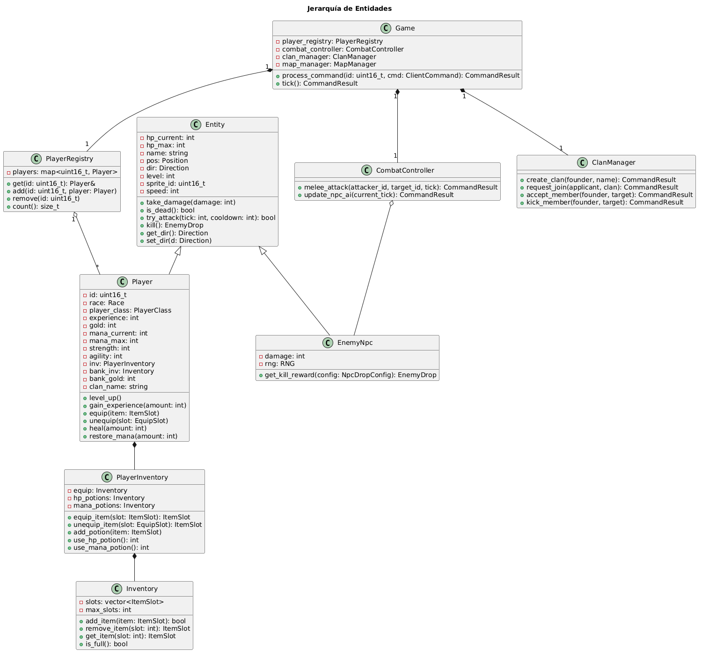
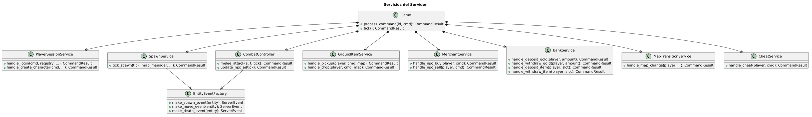
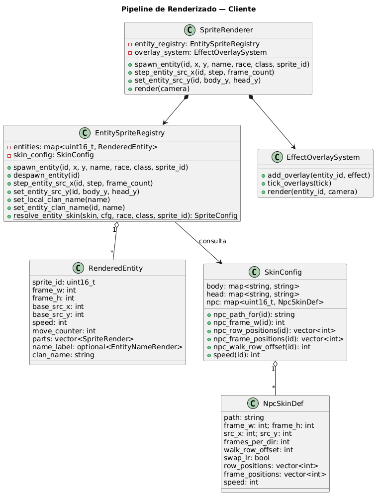
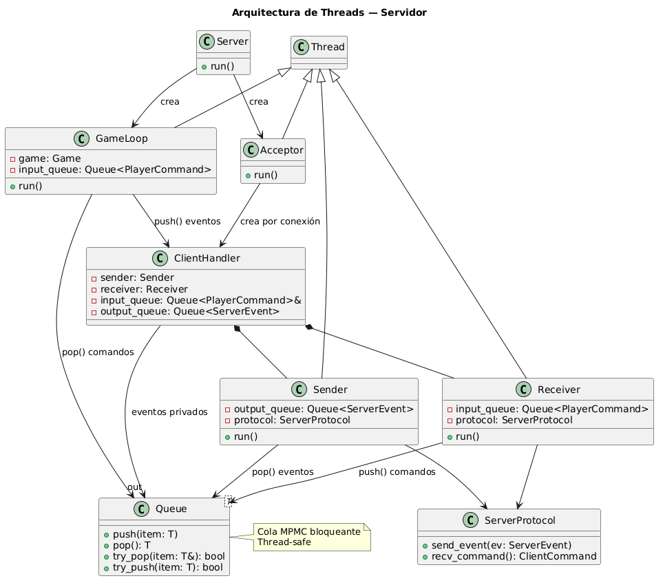
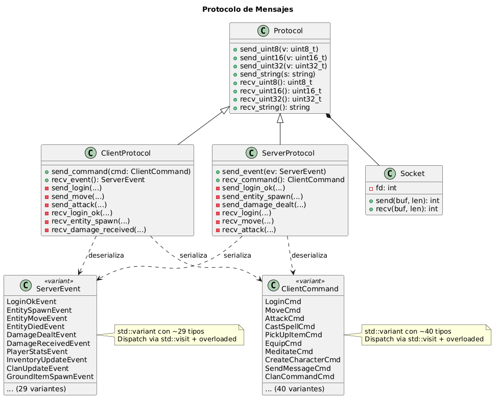
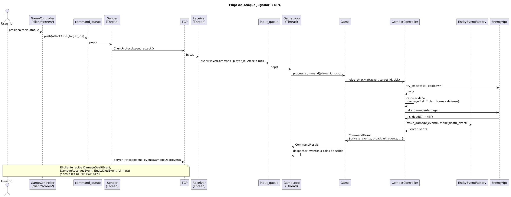
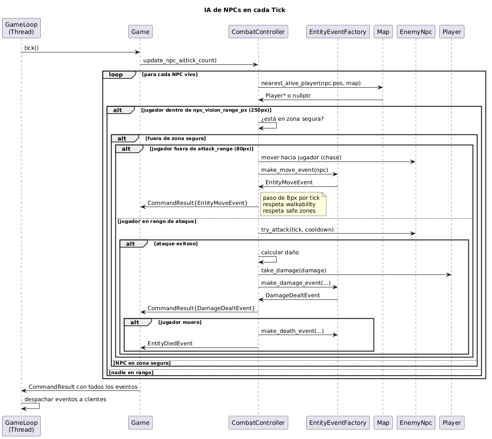

# Documentación Técnica — Argentum Online (TA045-1C2026)

Este documento describe la arquitectura del proyecto para que otro desarrollador
pueda entenderlo y continuar el desarrollo.

---

## 1. Diagramas de Clase

### 1.1 Jerarquía de Entidades, Jugador e Inventario

Centrado en `Entity` como clase base del modelo de objetos del juego.



---

### 1.2 Servicios del Servidor (Game Services)

El `Game` delega lógica a servicios especializados. Cada uno recibe referencias a
las dependencias que necesita (`PlayerRegistry`, `ClanManager`, etc.).



---

### 1.3 Renderizado del Cliente

Tras el refactor, el `SpriteRenderer` delega la gestión de entidades a
`EntitySpriteRegistry` y los efectos visuales a `EffectOverlaySystem`.



---

### 1.4 Arquitectura de Threads del Servidor

Muestra cómo los threads del servidor se comunican mediante colas bloqueantes.



---

### 1.5 Protocolo de Comunicación y Mensajes

Centrado en cómo se serializan y despachan los mensajes.



---

## 2. Diagramas de Secuencia

### 2.1 Flujo de Ataque (el más importante)



---

### 2.2 Flujo de Login


---

### 2.3 AI de NPCs — Tick del GameLoop



---

## 3. Formato de Archivos de Configuración

### 3.1 `config/server.toml`

Configuración del servidor: tick rate, balance de combate, drops.

```toml
[tick]
tick_rate_hz = 20          # ticks por segundo (50ms/tick)
save_interval_ticks = 600  # guardar persistencia cada N ticks

[attack]
attack_cooldown_ms = 500
attack_range_px = 80
npc_vision_range_px = 250  # rango de visión de NPCs
critical_chance = 0.15
max_level_diff = 10         # diferencia máxima de nivel para atacar

[clan]
max_members = 16
min_level_found = 6
clan_bonus_per_member = 0.05  # +5% daño/defensa por aliado cercano
clan_bonus_max = 0.25

[mob_spawn]
spawn_interval_ticks = 10
max_per_spawn_zone = 3
spawn_distance_px = 200     # distancia desde jugador

[npc_drop]
potion_chance = 0.20
gold_min = 1
gold_max = 10

[race_factors]              # multiplicadores de stats por raza
human = { hp = 1.0, mana = 1.0 }
elf = { hp = 0.85, mana = 1.20 }
dwarf = { hp = 1.20, mana = 0.75 }
gnome = { hp = 0.85, mana = 1.05 }

[class_factors]             # multiplicadores de stats por clase
warrior = { evasion = 0.25, mp_recovery = 0.75 }
mage = { evasion = 0.30, mp_recovery = 1.25 }
cleric = { evasion = 0.20, mp_recovery = 1.10 }
paladin = { evasion = 0.25, mp_recovery = 1.0 }

[vendors]                   # qué vende cada NPC interactivo
[vendors.comerciante]       # items que vende el comerciante
[vendors.sacerdote]         # items que vende el sacerdote
```

---

### 3.2 `config/client.toml`

Configuración del cliente: ventana, UI, sprites, skins, audio.

```toml
[window]
width = 1024
height = 768

[viewport]                  # recorte del área de juego
game_x = 11
game_y = 149
game_w = 734
game_h = 608

[font]
path = "assets/OUTPUT/Cardo.ttf"
name_size = 12
chat_size = 16

[ui]                        # posiciones y dimensiones de UI
[ui.inventory_panel]
x = 782; y = 202; cols = 4

[ui.hp_bar]                 # barra de vida
x = 790; y = 601; w = 218; h = 17

[ui.mp_bar]                 # barra de mana
[ui.exp_bar]                # barra de experiencia
[ui.merchant]               # panel de comercio
[ui.portrait]               # retrato del personaje

[skins]
  [skins.body]              # sprites por clase
  warrior = "assets/Graficos/1071.png"
  mage = "assets/Graficos/1291.png"
  cleric = "assets/Graficos/1279.png"
  paladin = "assets/Graficos/1228.png"

  [skins.head]              # sprites por raza
  human = "assets/Graficos/426.png"
  elf = "assets/Graficos/422.png"
  dwarf = "assets/Graficos/429.png"
  gnome = "assets/Graficos/425.png"

  [skins.npc]               # sprites por sprite_id
  4780 = { path = "assets/Graficos/4780.png",
           frame_w = 106, frame_h = 122,
           row_positions = [15, 132, 261, 386, 521, 643, 774, 904],
           frame_positions = [29, 187, 346, 507, 667, 827],
           walk_row_offset = 4, speed = 1 }

[[sprites]]                 # sprites base (movable + head anclado)
path = "assets/Graficos/1071.png"
x = 300; y = 160
width = 27; height = 48
src_x = 0; src_y = 0
movable = true

[movement]
move_step = 8
walk_src_step = 27
walk_src_frames_down = 6
walk_src_frames_up = 6
walk_src_frames_left = 5
walk_src_frames_right = 5
walk_frame_ms = 50
tick_ms = 33

[audio]
midi_music_path = "assets/midi/1.MID"
sfx_prefix = "assets/SoundsOgg/"

[sfx]
death = "11.ogg"
hit = "345.ogg"
sword = "180.ogg"
```

---

### 3.3 `config/npcs.toml`

Plantillas de NPCs (vida, daño, sprite, velocidad).

```toml
[[npc]]
name = "Orc"
base_hp = 600
base_damage = 28
sprite_id = 4780       # referencia a [skins.npc] en client.toml
speed = 1              # 1=lento (frame skip cada 2 ticks), 2=normal
dungeon_only = true    # solo spawnea en dungeons

[[npc]]
name = "Weak goblin"
base_hp = 100
base_damage = 5
sprite_id = 4754
# speed = 2 (default)
# dungeon_only = false (default)
```

---

### 3.4 `config/items.toml`

Definición de todos los items del juego.

```toml
[[item]]
item_type = "SWORD"
name = "Espada"
equip_slot = "WEAPON"
min_damage = 3
max_damage = 9
mana_cost = 0
price = 100
attack_range = 80

[[item]]
item_type = "HEALTH_POTION"
name = "Pocion de vida"
equip_slot = "NONE"
min_damage = 0
max_damage = 0
hp_restore = 50
price = 25
```

---

### 3.5 `config/map_list.toml` y archivos de mapa

Lista de mapas y su configuración de tiles/props/NPCs.

```toml
[[map]]
name = "city"
config = "config/city.toml"

[[map]]
name = "dungeon"
config = "config/dungeon.toml"
```

Cada archivo de mapa define:
- **Tilemap**: matriz de tiles (tile_id) con ancho/alto
- **Props**: objetos interactivos (comerciante, sacerdote, banquero, sanadora)
- **Npcs**: NPCs precolocados con tipo y posición
- **mob_spawn_zones**: rectángulos verdes donde spawnean mobs y se permite PvP

---

## 4. Protocolo de Comunicación

### 4.1 Formato Binario

El protocolo es **binario big-endian** sobre TCP. Cada mensaje empieza con un
**OpCode** de 1 byte, seguido del payload específico.

| Tipo      | Bytes | Codificación               |
|-----------|-------|----------------------------|
| `uint8_t` | 1     | Directo                    |
| `uint16_t`| 2     | `htons()` (network order)  |
| `uint32_t`| 4     | `htonl()` (network order)  |
| `string`  | 2 + N | uint16 largo + N bytes UTF-8 |
| `Position`| 4     | uint16 x + uint16 y        |

### 4.2 OpCodes

**Comandos (Cliente → Servidor):**

| OpCode | Comando          | Payload                                      |
|--------|------------------|----------------------------------------------|
| 0x01   | `LoginCmd`       | username (str) + password (str)              |
| 0x02   | `CreateCharacterCmd` | username + password + race (u8) + class (u8) + body (u8) + head (u8) |
| 0x03   | `MoveCmd`        | direction (u8)                               |
| 0x04   | `AttackCmd`      | target_id (u16)                              |
| 0x05   | `CastSpellCmd`   | target_id (u16)                              |
| 0x06   | `PickUpItemCmd`  | item_id (u16)                                |
| 0x07   | `DropItemCmd`    | slot (u8)                                    |
| 0x08   | `EquipCmd`       | slot (u8)                                    |
| 0x09   | `UnequipCmd`     | equip_slot (u8)                              |
| 0x10   | `SendMessageCmd` | message (str)                                |
| ...    | ...              | ...                                          |
| 0x29   | `ClanUnbanCmd`   | target_name (str)                            |

**Eventos (Servidor → Cliente):**

| OpCode | Evento              | Payload                                      |
|--------|---------------------|----------------------------------------------|
| 0x80   | `LoginOkEvent`      | player_id (u16) + stats + inventory + clan...|
| 0x81   | `LoginErrorEvent`   | error_msg (str)                              |
| 0x82   | `EntitySpawnEvent`  | entity_id (u16) + pos + name + race + class + sprite_id |
| 0x83   | `EntityMoveEvent`   | entity_id (u16) + pos + direction            |
| 0x84   | `EntityDiedEvent`   | entity_id (u16)                              |
| 0x85   | `DamageDealtEvent`  | target_id (u16) + damage (u16) + target_hp (u16) |
| 0x86   | `DamageReceivedEvent`| attacker_id (u16) + damage (u16) + current_hp (u16) |
| 0x87   | `PlayerStatsEvent`  | hp, mp, exp, gold, level, stats...           |
| ...    | ...                 | ...                                          |
| 0x9E   | `ClanUpdateEvent`   | clan_name (str)                              |
| 0x9F   | `BankUpdateEvent`   | gold (u32) + items...                        |

### 4.3 Dispatch con `std::visit`

Tanto el servidor como el cliente usan `std::visit` con el patrón `overloaded`
para despachar comandos/eventos sin switch/if:

```cpp
std::visit(overloaded{
    [&](const LoginCmd& cmd) { handle_login(player_id, cmd); },
    [&](const MoveCmd& cmd)  { handle_move(player_id, cmd); },
    [&](const AttackCmd& cmd){ handle_attack(player_id, cmd); },
    // ... 40 handlers
}, command);
```

El servidor despacha en `Game::process_command()` y devuelve un `CommandResult`
con eventos privados, dirigidos, y broadcast.

El cliente despacha en `ServerEventHandler::apply()` y modifica el estado
de renderizado (sprites, HP, inventario, etc.).

---

## 5. Formato de Archivos de Persistencia

Los datos de jugadores, clanes, inventario y banco se guardan en archivos
binarios con un sistema de índice + registros.

| Archivo         | Contenido                        |
|-----------------|----------------------------------|
| `data/players.idx` / `data/players.dat` | Cuentas de jugadores      |
| `data/clans.idx` / `data/clans.dat`     | Clanes                   |
| `data/inventory.idx` / `data/inventory.dat` | Inventarios de jugadores |
| `data/bank.idx` / `data/bank.dat`       | Banco de jugadores       |

**Formato de índice (.idx):**
- Header: `uint32_t count`
- Entradas: `[uint32_t offset] * count` (offset al registro en .dat)

**Formato de registro de jugador (.dat):**
- `uint8_t` deleted_flag (0x00 = activo, 0xFF = borrado)
- `string` username
- `string` password
- `uint8_t` race + `uint8_t` class + `uint8_t` body + `uint8_t` head
- `uint32_t` experience, gold, bank_gold
- `uint16_t` hp_max, mana_max
- `uint16_t` strength, agility, level
- `string` clan_name
- `uint8_t[4]` cheat_flags

---

## 6. Estructura del Proyecto (resumen de carpetas)

```
TA045-1C2026/
├── common/          # Código compartido (socket, protocolo, queue, thread, config, rng)
├── server/
│   ├── main.cpp     # Entry point del servidor
│   ├── core/        # Server, GameLoop, ServerConfig
│   ├── game/
│   │   ├── services/      # BankService, SpawnService, GroundItemService,
│   │   │                  #   MerchantService, MapTransitionService, CheatService,
│   │   │                  #   PlayerSessionService
│   │   ├── game.h/.cpp    # Game: process_command() + tick()
│   │   ├── entity.h/.cpp  # Entity base (HP, posición, dirección)
│   │   ├── player.h/.cpp  # Player extends Entity (stats, inventario, clan)
│   │   ├── enemy_npc.h/.cpp     # EnemyNpc extends Entity (IA, daño, drops)
│   │   ├── combat_controller.h/.cpp  # Ataques melee, spells, IA de NPCs
│   │   ├── clan_manager.h/.cpp      # Gestión de clanes
│   │   ├── entity_event_factory.h/.cpp # Factoría de eventos ServerEvent
│   │   ├── inventory.h/.cpp         # Inventario genérico
│   │   ├── player_inventory.h/.cpp  # Inventario compuesto (equip + pociones)
│   │   ├── game_formulas.h/.cpp     # Fórmulas de combate y progresión
│   │   ├── map.h/.cpp               # Tilemap, walkability, spawn zones
│   │   └── prop_grid.h/.cpp         # Props y NPCs en el mapa
│   ├── network/     # Acceptor, ClientHandler, ServerProtocol, Sender, Receiver
│   └── persistence/ # PlayerPersistence, ClanPersistence (archivos binarios)
├── client/
│   ├── main.cpp     # Entry point del cliente
│   ├── core/        # Client, Engine (máquina de estados)
│   ├── network/     # ClientProtocol, Sender, Receiver
│   ├── screen/      # GameController, ServerEventHandler, login, merchant
│   ├── render/
│   │   └── world/   # SpriteRenderer, EntitySpriteRegistry, EffectOverlaySystem,
│   │                 #   Camera, TilemapRenderer, PropRenderer, GroundItemRenderer
│   └── audio/       # AudioManager (SDL2_mixer)
├── config/          # Archivos TOML de configuración
├── data/            # Archivos binarios de persistencia
├── tests/           # Tests unitarios (GoogleTest, 294 tests)
├── assets/          # Gráficos, sonidos, fuentes
└── editor/          # Editor de mapas (Qt)
```
