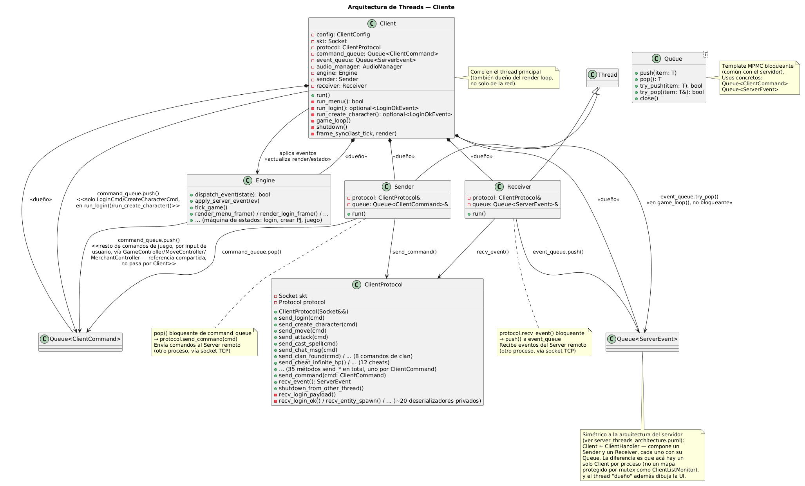

# Documentación técnica

Este documento describe la arquitectura del proyecto para que otro desarrollador
pueda entenderlo y continuar el desarrollo.

## Arquitectura general

Argentum MALT consta de **tres aplicaciones independientes**:

| Aplicación | Directorio | Tecnología | Propósito |
|---|---|---|---|
| `taller_server` | `server/` | C++20, sockets POSIX bloqueantes | Lógica del juego, persistencia, NPCs, combate |
| `taller_client` | `client/` | C++20, SDL2, libSDL2pp | Renderizado, audio, interfaz de usuario |
| `taller_editor` | `editor/` | C++20, Qt6 + SDL2 | Edición gráfica de mapas (guardado en TOML) |

Las tres comparten una biblioteca estática `taller_common` (`common/`) con la infraestructura común: sockets, protocolo binario, colas MPMC, threads, mensajes, configuradores TOML.

---

## 1. Arquitectura del servidor

### 1.1 Diagrama de clases

[server_classes.puml](uml/server_classes.puml) — Diagrama de clases centrado en la infraestructura de red y la lógica de juego (`Socket`, `Protocol`, `ServerProtocol`, `GameLoop`, `Game`, `ClientListMonitor`, `Server`), con atributos clave y métodos públicos. El detalle de threading (`Acceptor`, `Sender`, `Receiver` y los límites de cada hilo) está en [server_threads_architecture.puml](uml/server_threads_architecture.puml) para no duplicarlo.

### 1.2 Jerarquía de entidades, jugador e inventario

Centrado en `Entity` como clase base del modelo de objetos del juego.


[entities.puml](uml/entities.puml)

### 1.3 Servicios del servidor (Game Services)

El `Game` delega lógica a servicios especializados. Cada uno recibe referencias a las dependencias que necesita (`PlayerRegistry`, `ClanManager`, etc.).


[game_services.puml](uml/game_services.puml)

### 1.4 Resumen de las clases principales

#### `Socket` (`common/socket.h`)
Abstracción RAII sobre un file descriptor de socket TCP IPv4. Características destacadas:

- **Sockets bloqueantes** (requisito de la cátedra).
- Métodos `sendall`/`recvall` que garantizan envío/recepción de exactamente `sz` bytes.
- `stream_status` atómico (`std::atomic<int>`) para evitar data races entre threads (ver [ADR 0001](adr/0001-socket-shutdown-cross-thread-race.md)).
- `shutdown_from_other_thread()` diseñado específicamente para destrabar un socket bloqueante desde otro thread sin tocar el estado compartido.

#### `Protocol` (`common/protocol.h`)
Capa de serialización binaria sobre `Socket&`. Proporciona primitivas para enviar/recibir `uint8_t`, `uint16_t` (big-endian con `htons`/`ntohs`), `uint32_t` (big-endian con `htonl`/`ntohl`), strings (longitud + datos) y bools.

#### `ServerProtocol` (`server/network/server_protocol.h`)
Extiende `Protocol` con serialización de alto nivel: un método `send_*` por cada tipo de evento y un `recv_command()` que deserializa cualquier comando entrante mediante `std::visit`. Es dueño de un `Socket` (movido desde el `accept()`) y compone un `Protocol`.

#### `Acceptor` (`server/network/acceptor.h`)
Hereda de `Thread`. Corre en un loop aceptando conexiones entrantes y registrando cada una en `ClientListMonitor`. Al aceptar, crea un `ClientHandler` con un `Socket` nuevo, un ID asignado secuencialmente, y lo agrega al monitor.

#### `ClientListMonitor` (`server/network/client_list_monitor.h`)
Contenedor thread-safe de `ClientHandler`s. Protege con `std::mutex` un mapa `player_id → unique_ptr<ClientHandler>`. Ofrece:
- `add()` — crea un `ClientHandler`, arranca sus threads, asigna ID.
- `push_event()` — encola un evento en la cola de salida de un cliente específico.
- `broadcast()` — encola un evento en la cola de salida de todos los clientes.
- `clean_dead()` — detecta y remueve clientes cuyos threads ya terminaron.
- `stop_all()` — cierre ordenado de todos los clientes (usado en shutdown del servidor).

#### `ClientHandler` (`server/network/client_handler.h`)
Dueño de la conexión con un cliente. Compone:
- `ServerProtocol` — canal de comunicación serializado sobre el socket.
- `Queue<ServerEvent>` — cola MPMC de salida (escribe `GameLoop`, lee `Sender`).
- `Sender` (Thread) — drena la cola de salida y envía eventos al cliente.
- `Receiver` (Thread) — recibe comandos del cliente y los encola en la `Queue<PlayerCommand>` global.

#### `GameLoop` (`server/core/game_loop.h`)
Hereda de `Thread`. Corre a frecuencia fija configurable (default 20 Hz) con algoritmo de tasa constante. En cada tick:
1. Drena todos los `PlayerCommand` pendientes de la `Queue<PlayerCommand>` global y los procesa vía `Game::process_command()`.
2. Ejecuta `Game::tick()` (regeneración de vida/maná, resurrecciones pendientes, spawn de NPCs).
3. Distribuye los eventos resultantes (`CommandResult`) a los clientes vía `ClientListMonitor`.
4. Cada `save_interval_ticks`, persiste el estado de todos los jugadores.

#### `Game` (`server/game/game.h`)
Estado central del mundo. Contiene:
- `players`: `map<uint16_t, Player>` — todos los jugadores conectados.
- `enemy_npcs`: `map<uint16_t, EnemyNpc>` — NPCs enemigos.
- `maps`: `map<string, Map>` — mapas cargados desde TOML.
- `clan_manager`: gestión de clanes.
- 7 servicios especializados (`BankService`, `MerchantService`, `SpawnService`, `GroundItemService`, `MapTransitionService`, `PlayerSessionService`, `CheatService`).
- `combat_controller`: lógica de combate (daño, crítico, evasión, defensa).

Procesa comandos (`process_command`) a través de `std::visit` sobre `ClientCommand`, y produce `CommandResult` con los eventos generados.

### 1.5 Modelo de concurrencia

**Colas MPMC bloqueantes:**
- `Queue<PlayerCommand>` — una sola, global. Escriben todos los `Receiver`; lee `GameLoop`.
- `Queue<ServerEvent>` — una por cliente. Escribe `GameLoop` vía `ClientListMonitor`; lee `Sender`.

**Cierre de conexiones:**
- Cuando un thread `Receiver` detecta que el socket se cerró, su `run()` termina. En el próximo `clean_dead()` el `GameLoop` detecta al cliente muerto, llama `shutdown_from_other_thread()` al `Socket` para destrabar al `Sender` (si está bloqueado), hace `join()` de ambos threads y remueve al `ClientHandler`. Ver [ADR 0001](adr/0001-socket-shutdown-cross-thread-race.md) para el detalle de la data race resuelta.

Muestra cómo los threads del servidor se comunican mediante colas bloqueantes:


Diagrama de clases completo de threading: [server_threads_architecture.puml](uml/server_threads_architecture.puml).

---

## 2. Arquitectura del cliente

[client_classes.puml](uml/client_classes.puml) — Diagrama de clases centrado en la infraestructura de red y la lógica de juego/UI (`Socket`, `Protocol`, `ClientProtocol`, `Engine`, `GameController`, `ServerEventHandler`), análogo a [server_classes.puml](uml/server_classes.puml) del lado servidor. `GameController` cumple un rol similar a `Game`, pero solo refleja el estado que llega por `ServerEvent` — no es fuente de verdad.

El cliente corre todo en el thread principal salvo `Sender`/`Receiver` de red, que son simétricos a su contraparte del servidor: `Client` ≈ `ClientHandler`, compone un `Sender` y un `Receiver`, cada uno con su propia `Queue`. La diferencia es que hay un solo `Client` por proceso, y el thread "dueño" además dibuja la UI.



[client_threads_architecture.puml](uml/client_threads_architecture.puml)

Tras el refactor del renderizado, el `SpriteRenderer` delega la gestión de entidades a `EntitySpriteRegistry` y los efectos visuales a `EffectOverlaySystem`:


[client.puml](uml/client.puml)

---

## 3. Diagramas de secuencia

### 3.1 Flujo de ataque (el más importante)

Recorrido completo comando → `GameLoop` → `Game` → `CombatController` → eventos de vuelta a los clientes.


[attack.puml](uml/attack.puml)

### 3.2 Flujo de login

`LoginCmd` → `PlayerSessionService::handle_login` → `PlayerDataService::load_player` → `LoginOkEvent`/`LoginErrorEvent`.


[login.puml](uml/login.puml)

### 3.3 AI de NPCs — tick del GameLoop

IA de NPCs en cada tick del `GameLoop`: detección de jugador en rango de visión, persecución, ataque, respeto de zonas seguras.


[npc_ai.puml](uml/npc_ai.puml)

---

## 4. Protocolo de comunicación

El protocolo binario completo está documentado en [`protocol.md`](protocol.md). Incluye:

- 50 OpCodes (cliente → servidor y servidor → cliente)
- Formato de cada mensaje (diagramas de bytes)
- Enums para razas, clases, tipos de ítem, dirección, etc.
- Flujos de sesión: login, creación de personaje, combate, muerte, equipamiento

A nivel de clases, tanto servidor como cliente extienden `Protocol` (`common/protocol.h`) con su propia capa de alto nivel — `ServerProtocol` y `ClientProtocol` respectivamente — que serializan/deserializan los variants `ClientCommand` (~40 tipos) y `ServerEvent` (~29 tipos) vía `std::visit` + patrón `overloaded`:


[communication_mesagges_protocol.puml](uml/communication_mesagges_protocol.puml)

```cpp
std::visit(overloaded{
    [&](const LoginCmd& cmd) { handle_login(player_id, cmd); },
    [&](const MoveCmd& cmd)  { handle_move(player_id, cmd); },
    [&](const AttackCmd& cmd){ handle_attack(player_id, cmd); },
    // ... 40 handlers
}, command);
```

El servidor despacha en `Game::process_command()` y devuelve un `CommandResult` con eventos privados, dirigidos, y broadcast. El cliente despacha en `ServerEventHandler::apply()` y modifica el estado de renderizado (sprites, HP, inventario, etc.).

---

## 5. Formato de archivos de configuración

Todos los valores numéricos de balance, UI y assets viven en archivos TOML bajo `config/`.

### 5.1 `config/server.toml`

Configuración del servidor: tick rate, balance de combate, drops.

```toml
[tick]
tick_rate_hz = 20          # ticks por segundo (50ms/tick)
save_interval_ticks = 600  # guardar persistencia cada N ticks

[attack]
attack_cooldown_ms = 500
attack_range_px = 80
npc_vision_range_px = 250  # rango de visión de NPCs
critical_chance = 0.15
max_level_diff = 10         # diferencia máxima de nivel para atacar

[clan]
max_members = 16
min_level_found = 6
clan_bonus_per_member = 0.05  # +5% daño/defensa por aliado cercano
clan_bonus_max = 0.25

[mob_spawn]
spawn_interval_ticks = 10
max_per_spawn_zone = 3
spawn_distance_px = 200     # distancia desde jugador

[npc_drop]
potion_chance = 0.20
gold_min = 1
gold_max = 10

[race_factors]              # multiplicadores de stats por raza
human = { hp = 1.0, mana = 1.0 }
elf = { hp = 0.85, mana = 1.20 }
dwarf = { hp = 1.20, mana = 0.75 }
gnome = { hp = 0.85, mana = 1.05 }

[class_factors]             # multiplicadores de stats por clase
warrior = { evasion = 0.25, mp_recovery = 0.75 }
mage = { evasion = 0.30, mp_recovery = 1.25 }
cleric = { evasion = 0.20, mp_recovery = 1.10 }
paladin = { evasion = 0.25, mp_recovery = 1.0 }

[vendors]                   # qué vende cada NPC interactivo
[vendors.comerciante]       # items que vende el comerciante
[vendors.sacerdote]         # items que vende el sacerdote
```

### 5.2 `config/client.toml`

Configuración del cliente: ventana, UI, sprites, skins, audio.

```toml
[window]
width = 1024
height = 768

[viewport]                  # recorte del área de juego
game_x = 11
game_y = 149
game_w = 734
game_h = 608

[font]
path = "assets/OUTPUT/Cardo.ttf"
name_size = 12
chat_size = 16

[ui]                        # posiciones y dimensiones de UI
[ui.inventory_panel]
x = 782; y = 202; cols = 4

[ui.hp_bar]                 # barra de vida
x = 790; y = 601; w = 218; h = 17

[ui.mp_bar]                 # barra de mana
[ui.exp_bar]                # barra de experiencia
[ui.merchant]               # panel de comercio
[ui.portrait]               # retrato del personaje

[skins]
  [skins.body]              # sprites por clase
  warrior = "assets/Graficos/1071.png"
  mage = "assets/Graficos/1291.png"
  cleric = "assets/Graficos/1279.png"
  paladin = "assets/Graficos/1228.png"

  [skins.head]              # sprites por raza
  human = "assets/Graficos/426.png"
  elf = "assets/Graficos/422.png"
  dwarf = "assets/Graficos/429.png"
  gnome = "assets/Graficos/425.png"

  [skins.npc]               # sprites por sprite_id
  4780 = { path = "assets/Graficos/4780.png",
           frame_w = 106, frame_h = 122,
           row_positions = [15, 132, 261, 386, 521, 643, 774, 904],
           frame_positions = [29, 187, 346, 507, 667, 827],
           walk_row_offset = 4, speed = 1 }

[[sprites]]                 # sprites base (movable + head anclado)
path = "assets/Graficos/1071.png"
x = 300; y = 160
width = 27; height = 48
src_x = 0; src_y = 0
movable = true

[movement]
move_step = 8
walk_src_step = 27
walk_src_frames_down = 6
walk_src_frames_up = 6
walk_src_frames_left = 5
walk_src_frames_right = 5
walk_frame_ms = 50
tick_ms = 33

[audio]
midi_music_path = "assets/midi/1.MID"
sfx_prefix = "assets/SoundsOgg/"

[sfx]
death = "11.ogg"
hit = "345.ogg"
sword = "180.ogg"
```

### 5.3 `config/npcs.toml`

Plantillas de NPCs (vida, daño, sprite, velocidad).

```toml
[[npc]]
name = "Orc"
base_hp = 600
base_damage = 28
sprite_id = 4780       # referencia a [skins.npc] en client.toml
speed = 1              # 1=lento (frame skip cada 2 ticks), 2=normal
dungeon_only = true    # solo spawnea en dungeons

[[npc]]
name = "Weak goblin"
base_hp = 100
base_damage = 5
sprite_id = 4754
# speed = 2 (default)
# dungeon_only = false (default)
```

### 5.4 `config/items.toml`

Definición de todos los items del juego.

```toml
[[item]]
item_type = "SWORD"
name = "Espada"
equip_slot = "WEAPON"
min_damage = 3
max_damage = 9
mana_cost = 0
price = 100
attack_range = 80

[[item]]
item_type = "HEALTH_POTION"
name = "Pocion de vida"
equip_slot = "NONE"
min_damage = 0
max_damage = 0
hp_restore = 50
price = 25
```

### 5.5 `config/map_list.toml` y archivos de mapa

Lista de mapas y su configuración de tiles/props/NPCs.

```toml
[[map]]
name = "city"
config = "config/city.toml"

[[map]]
name = "dungeon"
config = "config/dungeon.toml"
```

Cada archivo de mapa define:
- **Tilemap**: matriz de tiles (tile_id) con ancho/alto
- **Props**: objetos interactivos (comerciante, sacerdote, banquero, sanadora)
- **Npcs**: NPCs precolocados con tipo y posición
- **mob_spawn_zones**: rectángulos verdes donde spawnean mobs y se permite PvP

---

## 6. Formato de persistencia

Los archivos de jugadores, inventarios, bancos y clanes se almacenan en `data/` con un formato binario de **tamaño fijo + archivo índice**:

| Archivo | Contenido |
|---|---|
| `data/players.idx` / `data/players.dat` | Cuentas de jugadores |
| `data/clans.idx` / `data/clans.dat` | Clanes |
| `data/inventory.idx` / `data/inventory.dat` | Inventarios de jugadores |
| `data/bank.idx` / `data/bank.dat` | Banco de jugadores |

### Archivo de datos (`*.dat`)
Registros de tamaño fijo y constante. Cada registro corresponde a un jugador, clan, slot de inventario o banco. Estructura típica del registro de jugador:

| Campo | Tipo | Tamaño |
|---|---|---|
| `deleted_flag` | uint8_t | 1 byte (0x00 = activo, 0xFF = borrado) |
| `username` | string | longitud + datos |
| `password` | string | longitud + datos |
| `race`, `player_class`, `body`, `head` | uint8_t | 1 byte c/u |
| `experience`, `gold`, `bank_gold` | uint32_t | 4 bytes c/u |
| `hp_max`, `mana_max` | uint16_t | 2 bytes c/u |
| `strength`, `agility`, `level` | uint16_t | 2 bytes c/u |
| `clan_name` | string | longitud + datos |
| `cheat_flags` | uint8_t[4] | 4 bytes |

Los enteros multi-byte se almacenan en **little-endian** (nativo del sistema), a diferencia del protocolo de red que es big-endian.

### Archivo índice (`*.idx`)
- Header: `uint32_t count`
- Mapa serializado `string → uint32_t` que asocia cada nombre de jugador (u otra clave) con su offset dentro del `.dat`. Al cargar, se lee completo en memoria; el archivo de datos se accede con `seek` + `read` de a un registro.

### Estrategia de guardado
- `GameLoop::save_all_players()` se ejecuta cada `save_interval_ticks` (default: 600 ticks = 30 s a 20 Hz).
- En cada guardado se reescribe el archivo `.dat` completo y luego el `.idx`.
- Los archivos de inventario y banco se guardan por separado con el mismo esquema.

---

## 7. Decisiones de arquitectura (ADRs)

- **[ADR 0001](adr/0001-socket-shutdown-cross-thread-race.md)**: Eliminar la data race entre `Socket::shutdown` y `recvsome`/`sendsome`. Separación de `shutdown_from_other_thread()` + `stream_status` atómico.

---

## 8. Estructura del proyecto (resumen de carpetas)

```
TA045-1C2026/
├── common/          # Código compartido (socket, protocolo, queue, thread, config, rng)
├── server/
│   ├── main.cpp     # Entry point del servidor
│   ├── core/        # Server, GameLoop, ServerConfig
│   ├── game/
│   │   ├── services/      # BankService, SpawnService, GroundItemService,
│   │   │                  #   MerchantService, MapTransitionService, CheatService,
│   │   │                  #   PlayerSessionService
│   │   ├── game.h/.cpp    # Game: process_command() + tick()
│   │   ├── entity.h/.cpp  # Entity base (HP, posición, dirección)
│   │   ├── player.h/.cpp  # Player extends Entity (stats, inventario, clan)
│   │   ├── enemy_npc.h/.cpp     # EnemyNpc extends Entity (IA, daño, drops)
│   │   ├── combat_controller.h/.cpp  # Ataques melee, spells, IA de NPCs
│   │   ├── clan_manager.h/.cpp      # Gestión de clanes
│   │   ├── entity_event_factory.h/.cpp # Factoría de eventos ServerEvent
│   │   ├── inventory.h/.cpp         # Inventario genérico
│   │   ├── player_inventory.h/.cpp  # Inventario compuesto (equip + pociones)
│   │   ├── game_formulas.h/.cpp     # Fórmulas de combate y progresión
│   │   ├── map.h/.cpp               # Tilemap, walkability, spawn zones
│   │   └── prop_grid.h/.cpp         # Props y NPCs en el mapa
│   ├── network/     # Acceptor, ClientHandler, ServerProtocol, Sender, Receiver
│   └── persistence/ # PlayerPersistence, ClanPersistence (archivos binarios)
├── client/
│   ├── main.cpp     # Entry point del cliente
│   ├── core/        # Client, Engine (máquina de estados)
│   ├── network/     # ClientProtocol, Sender, Receiver
│   ├── screen/      # GameController, ServerEventHandler, login, merchant
│   ├── render/
│   │   └── world/   # SpriteRenderer, EntitySpriteRegistry, EffectOverlaySystem,
│   │                 #   Camera, TilemapRenderer, PropRenderer, GroundItemRenderer
│   └── audio/       # AudioManager (SDL2_mixer)
├── config/          # Archivos TOML de configuración
├── data/            # Archivos binarios de persistencia
├── tests/           # Tests unitarios (GoogleTest, 294 tests)
├── assets/          # Gráficos, sonidos, fuentes
└── editor/          # Editor de mapas (Qt)
```
