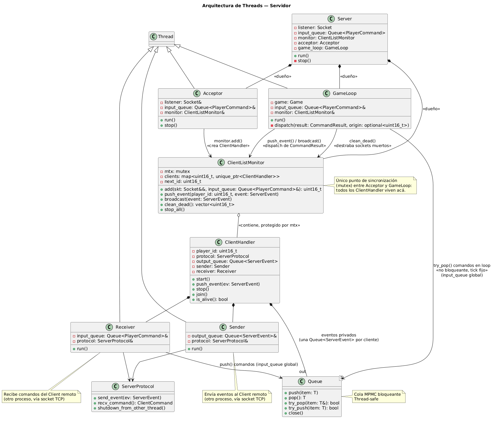
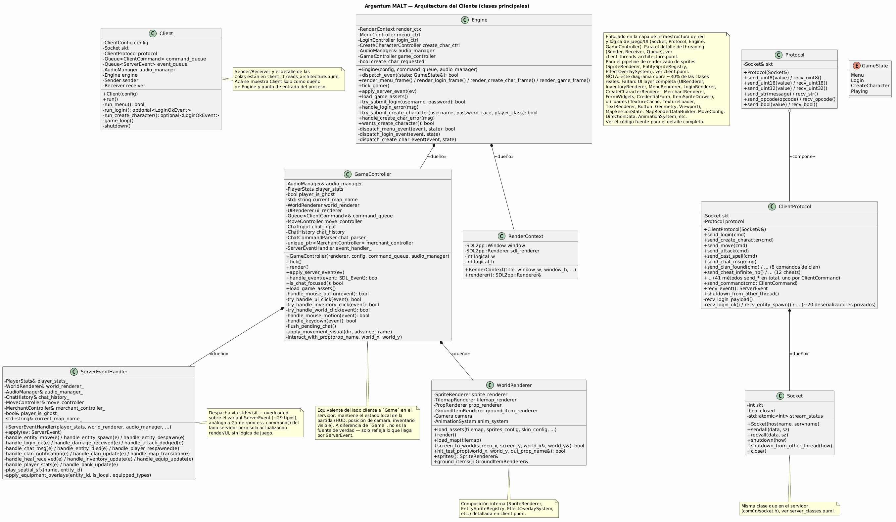
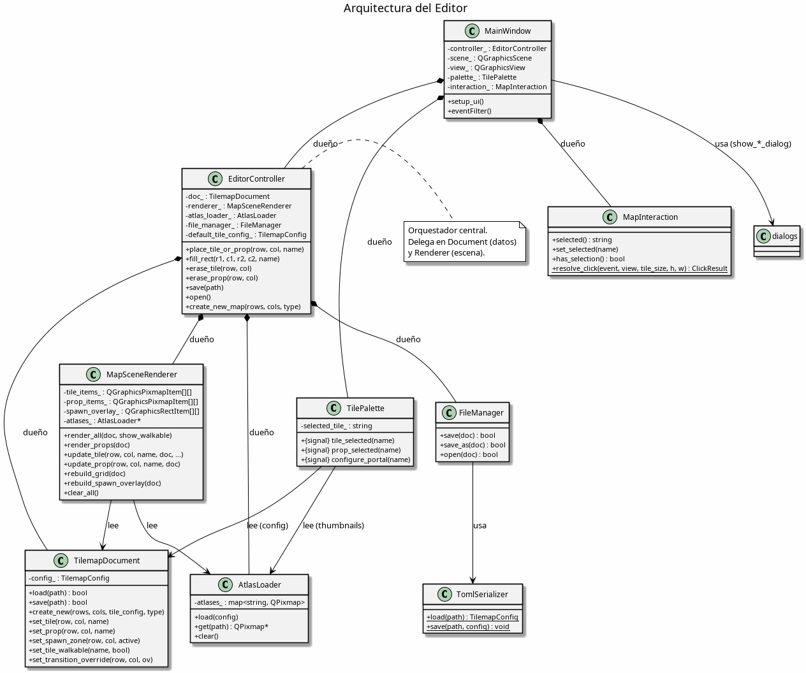
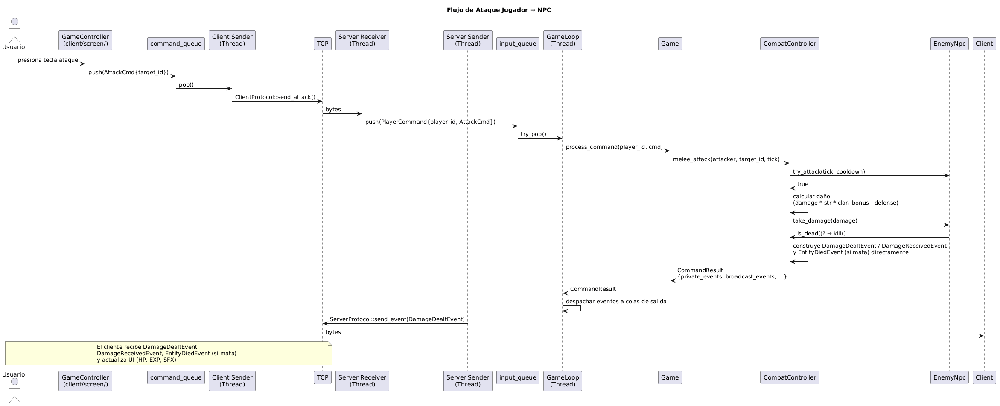
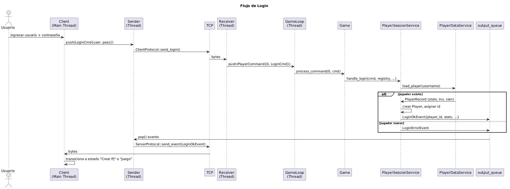
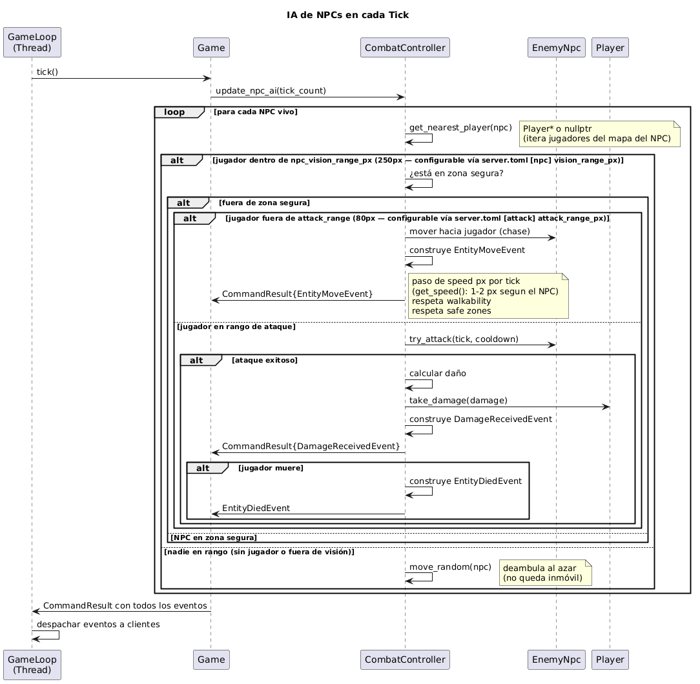
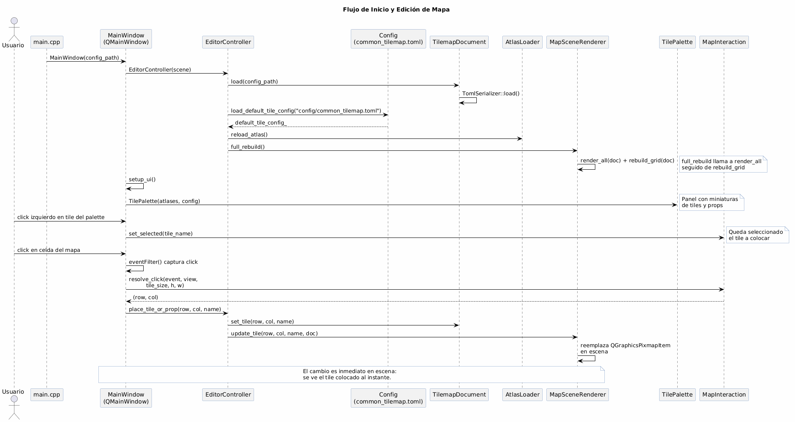
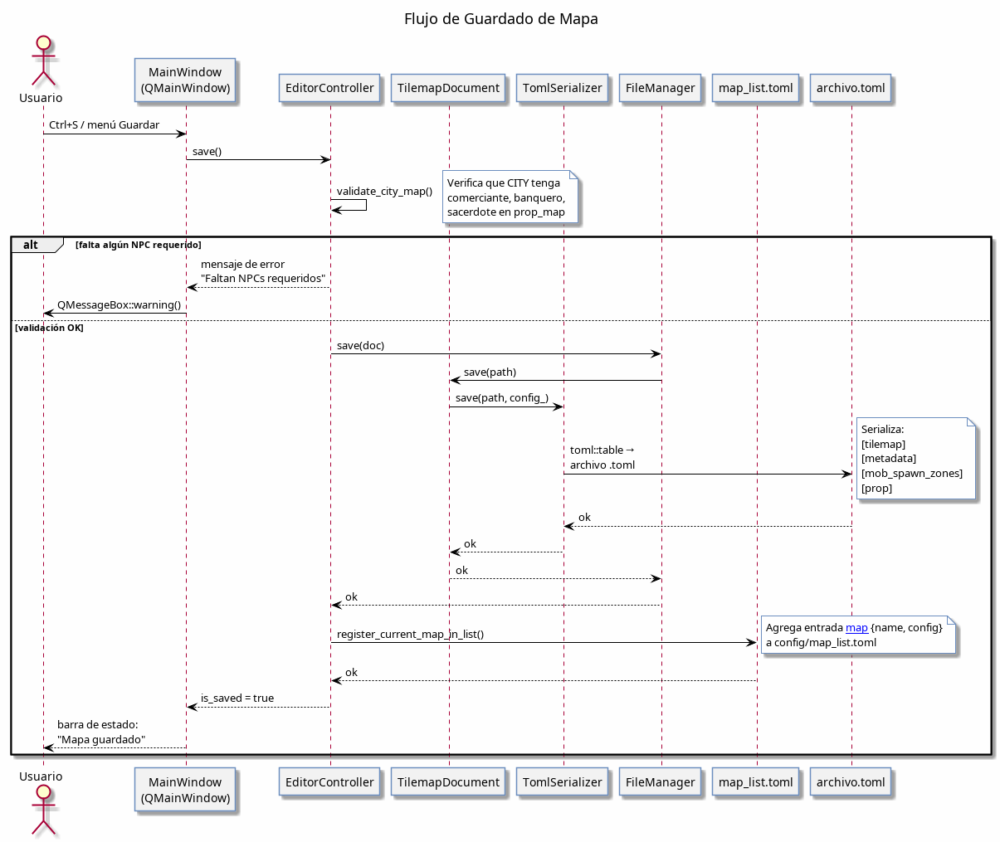
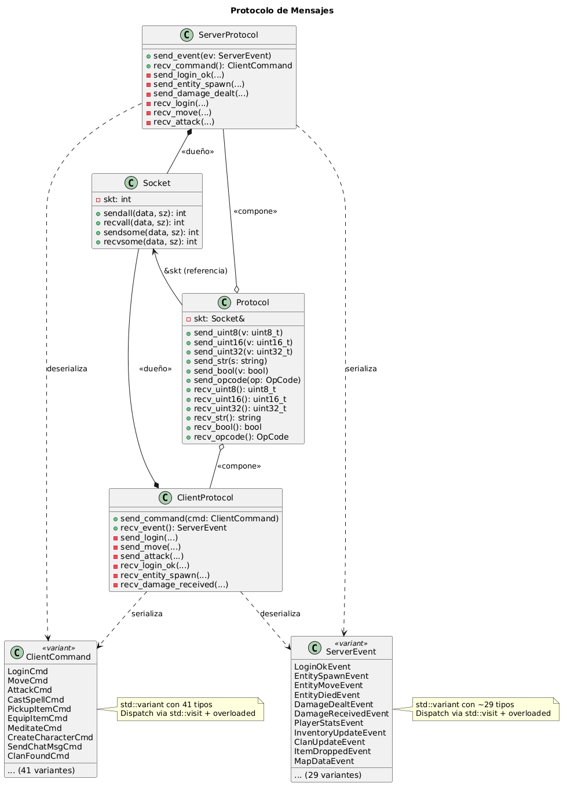

# Documentación técnica

Este documento describe la arquitectura del proyecto para que otro desarrollador
pueda entenderlo y continuar el desarrollo.

## Arquitectura general

Argentum MALT consta de **tres aplicaciones independientes**:

| Aplicación | Directorio | Tecnología | Propósito |
|---|---|---|---|
| `taller_server` | `server/` | C++20, sockets POSIX bloqueantes | Lógica del juego, persistencia, NPCs, combate |
| `taller_client` | `client/` | C++20, SDL2, libSDL2pp | Renderizado, audio, interfaz de usuario |
| `taller_editor` | `editor/` | C++20, Qt6 + SDL2 | Edición gráfica de mapas (guardado en TOML) |

Las tres comparten una biblioteca estática `taller_common` (`common/`) con la infraestructura común: sockets, protocolo binario, colas MPMC, threads, mensajes, configuradores TOML.

---

## 1. Arquitectura del servidor

### 1.1 Diagrama de clases

[server_classes.puml](uml/server_classes.puml) — Diagrama de clases centrado en la infraestructura de red y la lógica de juego (`Socket`, `Protocol`, `ServerProtocol`, `GameLoop`, `Game`, `ClientListMonitor`, `Server`), con atributos clave y métodos públicos. El detalle de threading (`Acceptor`, `Sender`, `Receiver` y los límites de cada hilo) está en [server_threads_architecture.puml](uml/server_threads_architecture.puml) para no duplicarlo.

### 1.2 Jerarquía de entidades, jugador e inventario

Centrado en `Entity` como clase base del modelo de objetos del juego.


[entities.puml](uml/entities.puml)

### 1.3 Servicios del servidor (Game Services)

El `Game` delega lógica a servicios especializados. Cada uno recibe referencias a las dependencias que necesita (`PlayerRegistry`, `ClanManager`, etc.).


[game_services.puml](uml/game_services.puml)

### 1.4 Resumen de las clases principales

#### `Socket` (`common/socket.h`)
Abstracción RAII sobre un file descriptor de socket TCP IPv4. Características destacadas:

- **Sockets bloqueantes** (requisito de la cátedra).
- Métodos `sendall`/`recvall` que garantizan envío/recepción de exactamente `sz` bytes.
- `stream_status` atómico (`std::atomic<int>`) para evitar data races entre threads (ver [ADR 0001](adr/0001-socket-shutdown-cross-thread-race.md)).
- `shutdown_from_other_thread()` diseñado específicamente para destrabar un socket bloqueante desde otro thread sin tocar el estado compartido.

#### `Protocol` (`common/protocol.h`)
Capa de serialización binaria sobre `Socket&`. Proporciona primitivas para enviar/recibir `uint8_t`, `uint16_t` (big-endian con `htons`/`ntohs`), `uint32_t` (big-endian con `htonl`/`ntohl`), strings (longitud + datos) y bools.

#### `ServerProtocol` (`server/network/server_protocol.h`)
Extiende `Protocol` con serialización de alto nivel: un método `send_*` por cada tipo de evento y un `recv_command()` que deserializa cualquier comando entrante mediante `std::visit`. Es dueño de un `Socket` (movido desde el `accept()`) y compone un `Protocol`.

#### `Acceptor` (`server/network/acceptor.h`)
Hereda de `Thread`. Corre en un loop aceptando conexiones entrantes y registrando cada una en `ClientListMonitor`. Al aceptar, crea un `ClientHandler` con un `Socket` nuevo, un ID asignado secuencialmente, y lo agrega al monitor.

#### `ClientListMonitor` (`server/network/client_list_monitor.h`)
Contenedor thread-safe de `ClientHandler`s. Protege con `std::mutex` un mapa `player_id → unique_ptr<ClientHandler>`. Ofrece:
- `add()` — crea un `ClientHandler`, arranca sus threads, asigna ID.
- `push_event()` — encola un evento en la cola de salida de un cliente específico.
- `broadcast()` — encola un evento en la cola de salida de todos los clientes.
- `clean_dead()` — detecta y remueve clientes cuyos threads ya terminaron.
- `stop_all()` — cierre ordenado de todos los clientes (usado en shutdown del servidor).

#### `ClientHandler` (`server/network/client_handler.h`)
Dueño de la conexión con un cliente. Compone:
- `ServerProtocol` — canal de comunicación serializado sobre el socket.
- `Queue<ServerEvent>` — cola MPMC de salida (escribe `GameLoop`, lee `Sender`).
- `Sender` (Thread) — drena la cola de salida y envía eventos al cliente.
- `Receiver` (Thread) — recibe comandos del cliente y los encola en la `Queue<PlayerCommand>` global.

#### `GameLoop` (`server/core/game_loop.h`)
Hereda de `Thread`. Corre a frecuencia fija configurable (default 20 Hz) con algoritmo de tasa constante. En cada tick:
1. Drena todos los `PlayerCommand` pendientes de la `Queue<PlayerCommand>` global y los procesa vía `Game::process_command()`.
2. Ejecuta `Game::tick()` (regeneración de vida/maná, resurrecciones pendientes, spawn de NPCs).
3. Distribuye los eventos resultantes (`CommandResult`) a los clientes vía `ClientListMonitor`.
4. Cada `save_interval_ticks`, persiste el estado de todos los jugadores.

#### `Game` (`server/game/game.h`)
Estado central del mundo. Contiene:
- `players`: `map<uint16_t, Player>` — todos los jugadores conectados.
- `enemy_npcs`: `map<uint16_t, EnemyNpc>` — NPCs enemigos.
- `maps`: `unordered_map<string, Map>` — mapas cargados desde TOML.
- `clan_manager`: gestión de clanes.
- 12 servicios especializados (en `server/game/services/`): `BankService`, `MerchantService`, `SpawnService`, `GroundItemService`, `MapTransitionService`, `MapDataService`, `PlayerSessionService`, `CheatService`, `MovementService`, `RegenService`, `ResurrectionService`, `SpellService`.
- `combat_controller`: lógica de combate (daño, crítico, evasión, defensa).

Procesa comandos (`process_command`) a través de `std::visit` sobre `ClientCommand`, y produce `CommandResult` con los eventos generados.

### 1.5 Modelo de concurrencia

**Colas MPMC bloqueantes:**
- `Queue<PlayerCommand>` — una sola, global. Escriben todos los `Receiver`; lee `GameLoop`.
- `Queue<ServerEvent>` — una por cliente. Escribe `GameLoop` vía `ClientListMonitor`; lee `Sender`.

**Cierre de conexiones:**
- Cuando un thread `Receiver` detecta que el socket se cerró, su `run()` termina. En el próximo `clean_dead()` el `GameLoop` detecta al cliente muerto, llama `shutdown_from_other_thread()` al `Socket` para destrabar al `Sender` (si está bloqueado), hace `join()` de ambos threads y remueve al `ClientHandler`. Ver [ADR 0001](adr/0001-socket-shutdown-cross-thread-race.md) para el detalle de la data race resuelta.

Muestra cómo los threads del servidor se comunican mediante colas bloqueantes:



Diagrama de clases completo de threading: [server_threads_architecture.puml](uml/server_threads_architecture.puml).

---

## 2. Arquitectura del cliente

Diagrama de clases centrado en la infraestructura de red y la lógica de juego/UI (`Socket`, `Protocol`, `ClientProtocol`, `Engine`, `GameController`, `ServerEventHandler`), análogo a [server_classes.puml](uml/server_classes.puml) del lado servidor. `GameController` cumple un rol similar a `Game`, pero solo refleja el estado que llega por `ServerEvent` — no es fuente de verdad.



[client_classes.puml](uml/client_classes.puml)

El cliente corre todo en el thread principal salvo `Sender`/`Receiver` de red, que son simétricos a su contraparte del servidor: `Client` ≈ `ClientHandler`, compone un `Sender` y un `Receiver`, cada uno con su propia `Queue`. La diferencia es que hay un solo `Client` por proceso, y el thread "dueño" además dibuja la UI.


[client_threads_architecture.puml](uml/client_threads_architecture.puml)

Tras el refactor del renderizado, el `SpriteRenderer` delega la gestión de entidades a `EntitySpriteRegistry` y los efectos visuales a `EffectOverlaySystem`:


[client.puml](uml/client.puml)

---

## 3. Arquitectura del editor

### 3.1 Diagrama de clases



[editor_classes.puml](uml/editor_classes.puml) — Diagrama de clases del editor gráfico, mostrando las relaciones entre `MainWindow`, `EditorController`, `TilemapDocument`, `MapSceneRenderer`, `AtlasLoader`, `TilePalette` y `FileManager`.

### 3.2 Resumen de las clases principales

#### `MainWindow` (`editor/core/main_window.h`)
`QMainWindow` que orquesta toda la interfaz del editor. Compone:
- `EditorController` — lógica de edición.
- `QGraphicsScene` + `QGraphicsView` — lienzo donde se renderiza el mapa.
- `TilePalette` — panel de selección de tiles y props.
- Menús (Archivo, Mapa, Ver), barra de herramientas y barra de estado (zoom).

Captura todos los eventos de mouse vía `eventFilter`: click izquierdo coloca el tile/prop seleccionado, click derecho borra, arrastre pinta rectángulos, Ctrl + rueda hace zoom.

#### `EditorController` (`editor/core/editor_controller.h`)
Orquestador central. Es dueño de:
- `TilemapDocument` — modelo del mapa en memoria.
- `AtlasLoader` — caché de `QPixmap` de los spritesheets.
- `MapSceneRenderer` — gestión de los `QGraphicsItem` en escena.
- `FileManager` — diálogos de archivo Qt.

Operaciones de edición: `place_tile_or_prop()`, `fill_rect()`, `erase_tile()`, `erase_prop()`. Maneja zonas de spawn, validación de mapas ciudad (deben tener comerciante, banquero y sacerdote), y registro del mapa en `config/map_list.toml` al guardar.

#### `TilemapDocument` (`editor/document/tilemap_document.h`)
Modelo de datos de un mapa. Wrappe un `TilemapConfig` (definido en `common/config.h`) y una ruta de archivo. Mantiene cuatro grillas paralelas:
- **Tiles** (`mapa`): nombre del tile en cada celda.
- **Props** (`prop_map`): nombre del prop en cada celda.
- **Spawn zones** (`mob_spawn_zones`): `bool` por celda indicando zona de spawn de NPCs.
- **Transition overrides** (`prop_transition_overrides`): portal destino por instancia (anula el default del `PropDef`).

#### `MapSceneRenderer` (`editor/render/map_scene_renderer.h`)
Mantiene grillas paralelas de `QGraphicsPixmapItem*` para tiles y props, y `QGraphicsRectItem*` para overlays. Métodos clave:
- `render_all()` / `render_props()` — construye la escena completa.
- `update_tile()` / `update_prop()` — reemplaza un item individual.
- Indicadores visuales: borde rojo en tiles no transitables, borde azul en props con portal, overlay verde en zonas de spawn.

#### `AtlasLoader` (`editor/render/atlas_loader.h`)
Carga spritesheets (`QPixmap`) desde disco deduplicando por ruta. Usado por `MapSceneRenderer` para los pixmaps de tiles/props y por `TilePalette` para las miniaturas.

#### `TilePalette` (`editor/ui/tile_palette.h`)
Panel plegable en el lado derecho con dos secciones ("Tiles" y "Props"). Cada entrada es un `QToolButton` con miniatura recortada del atlas. Soporta:
- Click izquierdo: seleccionar tile/prop.
- Click derecho en tile: alternar transitabilidad.
- Click derecho en prop: configurar portal (destino y posición de spawn vía `show_transition_dialog`).

#### `FileManager` (`editor/io/file_manager.h`)
Wrapper sobre `QFileDialog` para abrir y guardar archivos TOML.

#### `TomlSerializer` (`editor/io/toml_serializer.h`)
Serialización bidireccional entre `TilemapConfig` y archivo TOML. La lectura (`load`) delega en `parse_tilemap_config()` y `parse_prop_config()` de `common/config.cpp`, compartidas con servidor y cliente. La escritura (`save`) construye la tabla TOML manualmente con las secciones `[tilemap]`, `[metadata]`, `[mob_spawn_zones]` y `[prop]`.


### 3.3 Dependencia con `taller_common`

El editor comparte con servidor y cliente los tipos de `common/config.h`:
- `TilemapConfig`, `TileDef`, `PropDef`, `PropPartDef`, `HitboxDef`, `PropTransitionOverride`.
- Las funciones de parseo `parse_tilemap_config()`, `parse_prop_config()`.
- `MapType` enum (`NONE`, `CITY`, `DUNGEON`).
- `parse_map_grid()` para leer la matriz del mapa desde TOML.

Esto garantiza que el formato de mapa que produce el editor es exactamente el que consumen el servidor (para gameplay) y el cliente (para los catálogos visuales).

### 3.4 Tecnologías

| Componente | Tecnología | Propósito |
|---|---|---|
| GUI | Qt6 (Core, Widgets, OpenGL) | Ventanas, menús, diálogos, panel de selección |
| Renderizado | SDL2 (vía QPixmap) | Sprites del mapa, tiles, props, overlays |
| Serialización | toml++ | Carga/guardado de mapas en formato TOML |
| Librería común | `taller_common` | Tipos compartidos (`TilemapConfig`) y parseo TOML |

---

## 4. Diagramas de secuencia

### 4.1 Flujo de ataque (el más importante)

Recorrido completo comando → `GameLoop` → `Game` → `CombatController` → eventos de vuelta a los clientes.



[attack.puml](uml/attack.puml)

### 4.2 Flujo de login

`LoginCmd` → `PlayerSessionService::handle_login` → `PlayerDataService::load_player` → `LoginOkEvent`/`LoginErrorEvent`.



[login.puml](uml/login.puml)

### 4.3 AI de NPCs — tick del GameLoop

IA de NPCs en cada tick del `GameLoop`: detección de jugador en rango de visión, persecución, ataque, respeto de zonas seguras.



[npc_ai.puml](uml/npc_ai.puml)

### 4.4 Flujo de inicio y edición (editor)

Recorrido completo desde que arranca el editor hasta que el usuario coloca un tile en el mapa: carga de configuración default, carga del mapa inicial, renderizado de la escena, selección de tile en el palette y colocación en la grilla.



[editor_start_edit.puml](uml/editor_start_edit.puml)

### 4.5 Flujo de guardado de mapa (editor)

Validación del mapa (ciudad requiere NPCs), serialización TOML a través de `TomlSerializer`, escritura del archivo `.toml` y registro del mapa en `config/map_list.toml`.



[editor_save.puml](uml/editor_save.puml)

---

## 5. Protocolo de comunicación

El protocolo binario completo está documentado en [`protocol.md`](protocol.md). Incluye:

- 70 OpCodes (41 cliente → servidor y 29 servidor → cliente)
- Formato de cada mensaje (diagramas de bytes)
- Enums para razas, clases, tipos de ítem, dirección, etc.
- Flujos de sesión: login, creación de personaje, combate, muerte, equipamiento

A nivel de clases, tanto servidor como cliente extienden `Protocol` (`common/protocol.h`) con su propia capa de alto nivel — `ServerProtocol` y `ClientProtocol` respectivamente — que serializan/deserializan los variants `ClientCommand` (41 tipos) y `ServerEvent` (29 tipos) vía `std::visit` + patrón `overloaded`:



[communication_messages_protocol.puml](uml/communication_messages_protocol.puml)

```cpp
std::visit(overloaded{
    [&](const LoginCmd& cmd) { handle_login(player_id, cmd); },
    [&](const MoveCmd& cmd)  { handle_move(player_id, cmd); },
    [&](const AttackCmd& cmd){ handle_attack(player_id, cmd); },
    // ... 40 handlers
}, command);
```

El servidor despacha en `Game::process_command()` y devuelve un `CommandResult` con eventos privados, dirigidos, y broadcast. El cliente despacha en `ServerEventHandler::apply()` y modifica el estado de renderizado (sprites, HP, inventario, etc.).

---

## 6. Formato de archivos de configuración

Todos los valores numéricos de balance, UI y assets viven en archivos TOML bajo `config/`.

### 6.1 `config/server.toml`

Configuración del servidor: tick rate, balance de combate, drops.

```toml
[server]
tick_rate_hz = 20            # ticks por segundo (50ms/tick)
cheats_enabled = true        # habilita los comandos de debug
save_interval_seconds = 30   # (default) persistencia automática cada N segundos
                             #   GameLoop lo convierte a save_interval_ticks internamente

[attack]
base_damage = 10
damage_variance = 5       # ±5 de daño aleatorio sobre base_damage
attack_range_px = 80
spell_attack_range_px = 400
cooldown_ticks = 10
newbie_level = 12
max_level_diff = 10          # diferencia máxima de nivel para atacar
critical_chance = 0.003
critical_multiplier = 2
dodge_threshold = 0.001
clan_bonus_range_px = 200
clan_bonus_per_member = 0.05 # +5% daño/defensa por aliado cercano
clan_bonus_max = 0.25

[clan]
max_members = 16
min_level_found = 6
max_name_length = 30

[mob_spawn]                  # rango de nivel sorteado en zona normal
min_level = 1
max_level = 5
spawn_radius = 10
[mob_spawn.dungeon]          # rango de nivel sorteado en mazmorra
min_level = 6
max_level = 15

[balance]                    # oro, experiencia, posición inicial, fórmulas
starting_gold = 0
starting_map = "city"
level_exp_base = 1000
level_exp_exponent = 1.8
gold_cap_base = 100
gold_cap_exponent = 1.1

[balance.npc_drop]           # probabilidades de drop en zona normal (%)
gold_chance = 8.0
potion_chance = 1.0
item_chance = 1.0
[balance.npc_drop_dungeon]   # probabilidades de drop en mazmorra (%)
gold_chance = 20.0
potion_chance = 3.0
item_chance = 6.0

# Factores de raza/clase, cada uno en su propia tabla:
[race_hp_factor]             # (y [class_hp_factor], [race_mana_factor],
human = 1.0                  #  [class_mana_factor], [class_meditation_factor],
elf = 0.8                    #  [race_strength_factor], [class_strength_factor],
dwarf = 1.2                  #  [race_agility_factor], [class_agility_factor],
gnome = 1.0                  #  [recovery_rates], [constitution], [intelligence])

[vendors]                    # qué vende cada NPC interactivo (lista de item_type)
sacerdote = ["ASH_STAFF", "ELVEN_FLUTE", "KNOTTED_STAFF", "STUDDED_STAFF",
             "HEALTH_POTION", "MANA_POTION"]
comerciante = ["SWORD", "AXE", "HAMMER", "SIMPLE_BOW", "COMPOSITE_BOW",
               "LEATHER_ARMOR", "PLATE_ARMOR", "BLUE_TUNIC", "HOOD",
               "IRON_HELMET", "MAGIC_HAT", "TURTLE_SHIELD", "IRON_SHIELD",
               "HEALTH_POTION", "MANA_POTION"]
```

> El servidor tiene además secciones `[messages]` (textos de error/sistema, con
> placeholders `{}`) y `[help]` (texto del comando `/help`). Se omiten acá por
> extensión; ver `config/server.toml` para el detalle.

### 6.2 `config/client.toml`

Configuración del cliente: ventana, UI, sprites, skins, audio.

```toml
[window]
width = 1024
height = 768

[viewport]                  # recorte del área de juego
game_x = 11
game_y = 149
game_w = 734
game_h = 608

[font]
path = "assets/OUTPUT/Cardo.ttf"
name_size = 12
chat_size = 16

[ui]                        # posiciones y dimensiones de UI
[ui.inventory_panel]
x = 782; y = 202; cols = 4

[ui.hp_bar]                 # barra de vida
x = 790; y = 601; w = 218; h = 17

[ui.mp_bar]                 # barra de mana
[ui.exp_bar]                # barra de experiencia
[ui.merchant]               # panel de comercio
[ui.portrait]               # retrato del personaje

[skins]
  [skins.body]              # sprites por clase
  warrior = "assets/Graficos/1071.png"
  mage = "assets/Graficos/1291.png"
  cleric = "assets/Graficos/1279.png"
  paladin = "assets/Graficos/1228.png"

  [skins.head]              # sprites por raza
  human = "assets/Graficos/426.png"
  elf = "assets/Graficos/422.png"
  dwarf = "assets/Graficos/429.png"
  gnome = "assets/Graficos/425.png"

  [skins.npc]               # sprites por sprite_id
  4780 = { path = "assets/Graficos/4780.png",
           frame_w = 106, frame_h = 122,
           row_positions = [15, 132, 261, 386, 521, 643, 774, 904],
           frame_positions = [29, 187, 346, 507, 667, 827],
           walk_row_offset = 4, speed = 1 }

[[sprites]]                 # sprites base (movable + head anclado)
path = "assets/Graficos/1071.png"
x = 300; y = 160
width = 27; height = 48
src_x = 0; src_y = 0
movable = true

[movement]                  # move_step vive en common.toml (compartido con el servidor)
walk_src_step = 27
walk_src_frames_down = 6
walk_src_frames_up = 6
walk_src_frames_left = 5
walk_src_frames_right = 5
walk_frame_ms = 50
tick_ms = 33

[audio]
midi_music_path = "assets/midi/1.MID"
sfx_prefix = "assets/SoundsOgg/"

[sfx]
death = "11.ogg"
hit = "345.ogg"
sword = "180.ogg"
```

> Los valores que deben coincidir entre servidor y cliente viven en
> `config/common.toml`, no duplicados en cada lado: `[network] port`,
> `[movement] move_step` y `[merchant] sell_price_ratio`.

### 6.3 `config/npcs.toml`

Plantillas de NPCs (vida, daño, sprite, velocidad).

```toml
[[npc]]
name = "Orc"
base_hp = 600
base_damage = 28
sprite_id = 4780       # referencia a [skins.npc] en client.toml
speed = 1              # 1=lento (frame skip cada 2 ticks), 2=normal
dungeon_only = true    # solo spawnea en dungeons

[[npc]]
name = "Weak goblin"
base_hp = 100
base_damage = 5
sprite_id = 4754
# speed = 2 (default)
# dungeon_only = false (default)
```

### 6.4 `config/items.toml`

Definición de todos los items del juego.

```toml
[[item]]
item_type = "SWORD"
name = "Espada"
equip_slot = "WEAPON"
min_damage = 2
max_damage = 5
mana_cost = 0
min_defense = 0
max_defense = 0
price = 50

[[item]]
item_type = "HEALTH_POTION"
name = "Pocion de vida"
equip_slot = "CONSUMABLE"
min_damage = 0
max_damage = 0
restore_hp_percent = 100   # las pociones restauran el 100% del recurso
price = 30
```

### 6.5 `config/map_list.toml` y archivos de mapa

Lista de mapas y su configuración de tiles/props/NPCs.

```toml
maps = [
    { name = 'city',    path = 'config/city.toml' },
    { name = 'dungeon', path = 'config/dungeon.toml' },
]
```

Cada archivo de mapa define:
- **Tilemap**: matriz de tiles (tile_id) con ancho/alto
- **Props**: objetos interactivos (comerciante, sacerdote, banquero, sanadora)
- **Npcs**: NPCs precolocados con tipo y posición
- **mob_spawn_zones**: rectángulos verdes donde spawnean mobs y se permite PvP

> Estos archivos son la **fuente de verdad del servidor**. El cliente ya **no** los
> lee: descarga la geometría del servidor por red (ver 5.6).

### 6.6 Separación nivel (red) / visual (local): `config/visuals/`

La consigna exige que *"el cliente descargue los niveles del servidor"*. Para
cumplirlo respetando responsabilidad única se separan dos cosas que antes vivían
juntas en `config/<mapa>.toml`:

- **Dato de nivel** (gameplay/estructura): qué hay en cada celda, transitabilidad,
  posición de props y zonas de spawn. Es autoridad del servidor y viaja por red en
  `MapLevelData` (mensaje `MAP_DATA`, opcode `0x9B`), con la grilla comprimida por
  diccionario (tabla de ids únicos + índices `uint16_t`).
- **Dato visual** (`MapVisualCatalog`): paths de assets, frames de animación,
  tamaños y offsets de hitbox para dibujar. Es contenido pre-instalado del cliente,
  análogo a cómo `[skins.npc]` en `client.toml` resuelve el `sprite_id` que manda
  `ENTITY_SPAWN`. Vive en `config/visuals/<mapa>.toml` y se carga entero al boot.

Piezas nuevas:

| Clase | Lado | Rol |
|---|---|---|
| `MapLevelDataBuilder` | servidor | `Map` (TilemapConfig + PropGrid) → `MapLevelData` (DTO de red) |
| `MapDataService` | servidor | responde `REQUEST_MAP_DATA` con `MapDataEvent` privado al jugador |
| `MapVisualCatalog` | cliente | catálogo visual local por mapa (`config/visuals/`) |
| `MapRenderDataBuilder` | cliente | `MapLevelData` + `MapVisualCatalog` → `TilemapConfig` reconstruido |

Así **no hubo que tocar `TilemapRenderer` ni `PropRenderer`**: siguen consumiendo
un `TilemapConfig`, solo que ahora reconstruido a partir de la red en vez de leído
de disco. El cliente cachea cada `MapLevelData` en memoria de sesión (no se
persiste), así volver a un mapa ya visitado no lo vuelve a pedir.

---

## 7. Formato de persistencia

Los archivos de jugadores, inventarios, bancos y clanes se almacenan en `data/` con un formato binario de **tamaño fijo + archivo índice**:

| Archivo | Contenido |
|---|---|
| `data/players.idx` / `data/players.dat` | Cuentas de jugadores |
| `data/clans.idx` / `data/clans.dat` | Clanes |
| `data/inventory.idx` / `data/inventory.dat` | Inventarios de jugadores |
| `data/bank.idx` / `data/bank.dat` | Banco de jugadores |

### Archivo de datos (`*.dat`)
Registros de tamaño fijo y constante. Cada registro corresponde a un jugador, clan, slot de inventario o banco. El registro de jugador (`PlayerRecord`, `server/persistence/player_record.h`) se serializa en este orden exacto:

| Campo | Tipo | Tamaño |
|---|---|---|
| `username` | char[32] | 32 bytes (string C de longitud fija, padding con `\0`) |
| `password` | char[32] | 32 bytes |
| `pos_x`, `pos_y` | uint16_t | 2 bytes c/u |
| `dir`, `race`, `player_class`, `level` | uint8_t | 1 byte c/u |
| `experience` | uint32_t | 4 bytes |
| `hp_current`, `hp_max` | uint32_t | 4 bytes c/u |
| `mana_current`, `mana_max` | uint32_t | 4 bytes c/u |
| `gold`, `bank_gold` | uint32_t | 4 bytes c/u |
| `current_map` | char[32] | 32 bytes |
| `equipped_type[4]` | uint8_t[4] | 4 bytes (arma, armadura, casco, escudo) |
| `equipped_name[4][32]` | char[4][32] | 128 bytes |

No se persisten `strength`/`agility` (se derivan de raza/clase/nivel vía `GameFormulas`), la pertenencia a clan (vive en `clans.dat`) ni los cheats (son de sesión). Tampoco hay flag de borrado: no existe mecanismo de baja de cuentas.

Los enteros multi-byte se almacenan en **little-endian** de forma explícita e independiente de la arquitectura del host (`server/persistence/endian_io.h`), a diferencia del protocolo de red que es big-endian.

El inventario y el banco usan su propio registro (`InventorySlotRecord`: `char item_name[32]` + `uint8_t item_type`) en `inventory.dat`/`bank.dat`. Los clanes usan `ClanRecord` (`clan_name`, `founder_username`, lista de miembros y de baneados) en `clans.dat`.

### Archivo índice (`*.idx`)
- No tiene header. Es una secuencia de entradas leídas hasta EOF; cada entrada es `uint32_t name_len` (LE) + `name_len` bytes (la clave, p. ej. el nombre de jugador) + `uint32_t offset` (LE) hacia el registro dentro del `.dat`.
- Al cargar se lee completo a un `map<string, uint32_t>` en memoria; el `.dat` se accede con `seek(offset)` + lectura de un registro.

### Estrategia de guardado
- `GameLoop::save_all_players()` se ejecuta cada `save_interval_ticks` (default: 600 ticks = 30 s a 20 Hz) e itera los jugadores conectados llamando `PlayerDataService::save_player()` por cada uno.
- El guardado es **por registro**, no reescribe el `.dat` entero: si el jugador ya existe, se sobrescribe su registro in situ (`seek(offset)` + write); si es nuevo, se hace append al final del `.dat` y se reescribe el `.idx` con la nueva entrada.
- Inventario y banco se guardan por separado con el mismo esquema (`.dat` de registros fijos + `.idx` de offsets).

---

## 8. Decisiones de arquitectura (ADRs)

- **[ADR 0001](adr/0001-socket-shutdown-cross-thread-race.md)**: Eliminar la data race entre `Socket::shutdown` y `recvsome`/`sendsome`. Separación de `shutdown_from_other_thread()` + `stream_status` atómico.

---

## 9. Estructura del proyecto (resumen de carpetas)

```
Argentum-MALT/
├── common/          # Código compartido (socket, protocolo, queue, thread, config, rng)
├── server/
│   ├── main.cpp     # Entry point del servidor
│   ├── core/        # Server, GameLoop, ServerConfig
│   ├── game/
│   │   ├── services/      # 12 servicios: BankService, MerchantService,
│   │   │                  #   SpawnService, GroundItemService, MapTransitionService,
│   │   │                  #   MapDataService, PlayerSessionService, CheatService,
│   │   │                  #   MovementService, RegenService, ResurrectionService,
│   │   │                  #   SpellService
│   │   ├── game.h/.cpp    # Game: process_command() + tick()
│   │   ├── entity.h/.cpp  # Entity base (HP, posición, dirección)
│   │   ├── player.h/.cpp  # Player extends Entity (stats, inventario, clan)
│   │   ├── enemy_npc.h/.cpp     # EnemyNpc extends Entity (IA, daño, drops)
│   │   ├── combat_controller.h/.cpp  # Ataques melee e IA de NPCs (los hechizos
│   │   │                  #   se despachan en services/spell_service)
│   │   ├── clan_manager.h/.cpp      # Gestión de clanes
│   │   ├── entity_event_factory.h/.cpp # Factoría de eventos ServerEvent
│   │   ├── inventory.h/.cpp         # Inventario genérico
│   │   ├── player_inventory.h/.cpp  # Inventario compuesto (equip + pociones)
│   │   ├── game_formulas.h/.cpp     # Fórmulas de combate y progresión
│   │   ├── map.h/.cpp               # Tilemap, walkability, spawn zones
│   │   ├── map_level_data_builder.h/.cpp  # Map -> MapLevelData (DTO de red)
│   │   └── prop_grid.h/.cpp         # Props y NPCs en el mapa
│   ├── network/     # Acceptor, ClientHandler, ServerProtocol, Sender, Receiver
│   └── persistence/ # PlayerPersistence, InventoryPersistence (inventario y banco),
│                     #   ClanPersistence (archivos binarios)
├── client/
│   ├── main.cpp     # Entry point del cliente
│   ├── core/        # Client, Engine, GameController, ServerEventHandler,
│   │                 #   MapRenderDataBuilder (MapLevelData + visual -> TilemapConfig)
│   ├── config/      # ClientConfig, MapVisualCatalog (config/visuals/)
│   ├── network/     # ClientProtocol, Sender, Receiver
│   ├── render/
│   │   └── world/   # SpriteRenderer, EntitySpriteRegistry, EffectOverlaySystem,
│   │                 #   Camera, TilemapRenderer, PropRenderer, GroundItemRenderer
│   └── audio/       # AudioManager (SDL2_mixer)
├── config/          # Archivos TOML de configuración
│   └── visuals/     # Catálogos visuales por mapa (cliente; sin geometría)
├── data/            # Archivos binarios de persistencia
├── tests/           # Tests unitarios (GoogleTest, 314 tests)
├── assets/          # Gráficos, sonidos, fuentes
└── editor/          # Editor de mapas (Qt)
```
