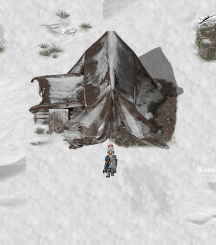

  

**Argentum Online** es un videojuego de rol multijugador masivo en línea (MMORPG) de origen argentino. Fue creado en 1999 por Pablo Márquez junto a un grupo de amigos, siendo el primer MMORPG desarrollado en Argentina. Esta es una recreación del juego clásico desarrollada como proyecto final de la materia Taller de Programación (TA045) de la Facultad de Ingeniería de la Universidad de Buenos Aires.

Estilo gráfico 2D top-down y ambientación de fantasía medieval. Creá tu personaje, explorá un mundo abierto, combatí monstruos y otros jugadores, formá clanes y mucho más.

---

## Secciones

**Video Trailer**

****

Video promocional del juego.

**[Manual de Usuario](manual-de-usuario)**

Guía completa del juego: instalación, controles, combate, ítems, clanes, comandos y más.

**[Documentación técnica](documentacion-tecnica)**

Arquitectura, protocolo, configuración y detalles de implementación.

**[Manual de Proyecto](manual-de-proyecto)**

Organización del equipo, herramientas, planificación semanal y retrospectiva.

---

*Repositorio: [github.com/.../Argentum-MALT](https://github.com/MateoGonzalezPautaso/Argentum-MALT)*
