# Manual de Argentum Online

## 1. Introducción

¿Qué es Argentum Online?

Argentum Online (también conocido como AO) es un videojuego de rol multijugador masivo en línea (MMORPG) de origen argentino. Fue creado en 1999 por Pablo Márquez (conocido como "Gulfas Morgolock") junto a un grupo de amigos, y tiene la distinción de ser el primer MMORPG desarrollado en Argentina. 

El juego se caracteriza por su estilo gráfico 2D top-down y su ambientación de fantasía medieval, donde los jugadores pueden crear personajes, explorar un mundo abierto, completar misiones, combatir monstruos y otros jugadores, y formar clanes.

---

## 2. Instalación y ejecución

### 2.1 Dependencias necesarias e instalación

El juego cuenta con las siguientes dependencias:

    - Herramientas de compilación: build-essential, cmake, git, pkg-config, ninja-build

    - Testing y análisis estático: libgtest-dev, valgrind, cppcheck, clang-format

    - X11 (requerido por SDL2): libx11-dev, libxext-dev, libxrandr-dev, libxi-dev, libxcursor-dev, libxinerama-dev, libxss-dev, libxxf86vm-dev

    - OpenGL (requerido por SDL2): libgl1-mesa-dev, libgles2-mesa-dev, libegl1-mesa-dev

    - Audio backends (requerido por SDL2_mixer): libasound2-dev, libpulse-dev, libpipewire-0.3-dev (opcional), libjack-jackd2-dev (opcional)

    - Codecs de audio para SDL2_mixer: libopus-dev, libopusfile-dev, libvorbis-dev, libogg-dev, libflac-dev, libmpg123-dev, libmodplug-dev, libxmp-dev, libfluidsynth-dev, fluidsynth, libwavpack-dev

    - SDL2_ttf (fuentes): libfreetype-dev, libharfbuzz-dev

    - SDL2_image: libpng-dev, libjpeg-dev, libtiff-dev, libwebp-dev

    - SDL2 — las librerías en sí: libsdl2-dev, libsdl2-image-dev, libsdl2-ttf-dev, libsdl2-mixer-dev

    - Qt6 — para el editor gráfico: qt6-base-dev, qt6-tools-dev-tools, libqt6widgets6t64, libqt6opengl6-dev

    - Utilidades adicionales: libssl-dev, zlib1g-dev

Todas estas dependencias se instalan y configuran automáticamente al ejecutar el instalador, por lo que no es necesario instalarlas manualmente.

El instalador se llama `install.sh` y se encuentra en la raíz del proyecto. Para ejecutarlo, abre una terminal, navega hasta el directorio del proyecto y ejecuta:

```bash
chmod +x install.sh
./install.sh
```
Esto descargará, compilará e instalará todas las dependencias necesarias, así como el juego en sí.


### 2.2 Iniciar el servidor

El servidor de Argentum Online se llama 'taller_server' y se encuentra en el directorio 'build'. Para iniciarlo, abre una terminal y ejecuta:

```bash
cd build
./taller_server
```
Esto iniciará el servidor en el puerto 1234 por defecto. Asegúrate de que el servidor esté corriendo antes de intentar conectarte con el cliente.

### 2.3 Iniciar el cliente

El cliente de Argentum Online se llama 'taller_client' y también se encuentra en el directorio 'build'. Para iniciarlo, abre una terminal y ejecuta:

```bash
cd build
./taller_client
```
Esto iniciará el cliente y te llevará a la pantalla de inicio de sesión, donde podrás ingresar tus credenciales para conectarte al servidor.

El cliente acepta los siguientes argumentos opcionales:

```bash
./taller_client [--fullscreen] [--width <valor>] [--height <valor>]
```

| Argumento | Descripción |
|-----------|-------------|
| `--fullscreen` | Inicia el cliente en pantalla completa |
| `--width <valor>` | Ancho de la ventana en píxeles (ej: 1280) |
| `--height <valor>` | Alto de la ventana en píxeles (ej: 720) |


---

## 3. Creación de personaje

### 3.1 Login / Registro

Cuando inicias el cliente por primera vez, se te presentará una pantalla de Start de sesión. 

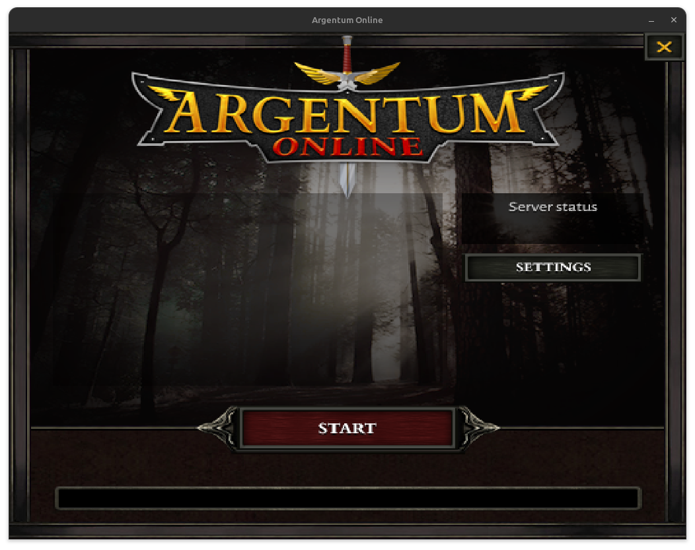

Si ya tienes una cuenta, puedes ingresar tu nombre de usuario y contraseña para acceder al juego. Si no tienes una cuenta, puedes registrarte haciendo clic en el botón "Create Character" y eligiendo una raza y clase para el nuevo jugador.

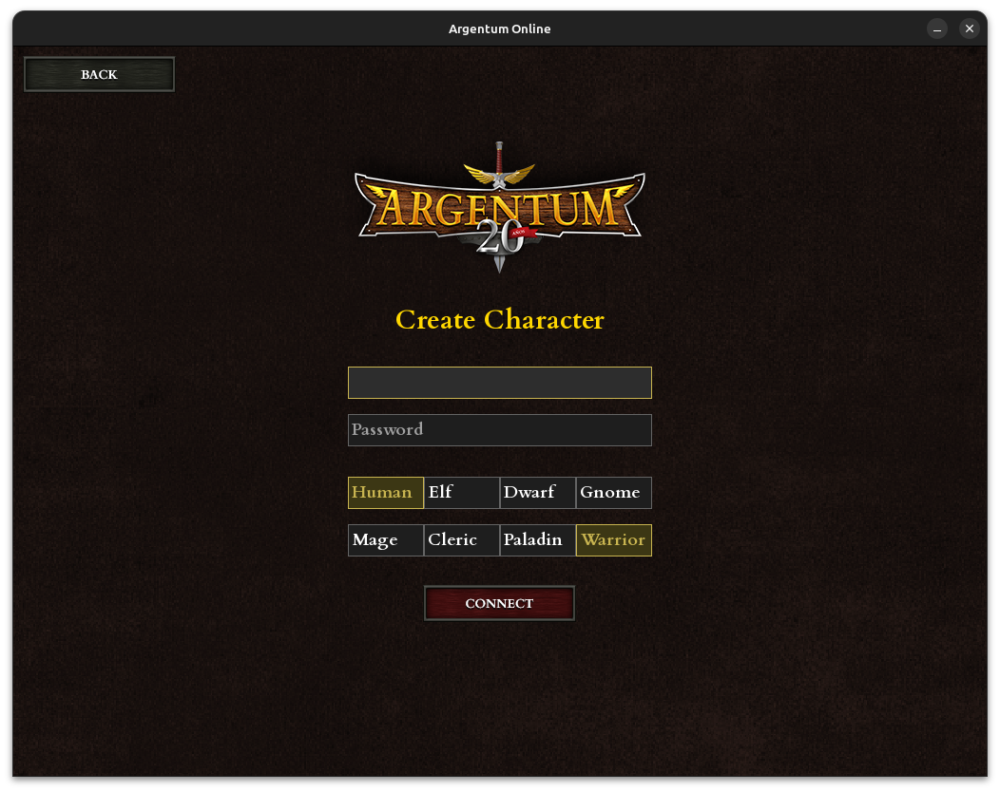

### 3.2 Razas

| Raza | Fuerza | Agilidad | Inteligencia | Constitución | Bonus |
|------|--------|----------|--------------|--------------|-------|
| Humano | 1.0× | 0.9× | 20 | 20 | Balanceado |
| Elfo | 0.7× | 1.5× | 25 | 15 | Magia y velocidad |
| Enano | 1.3× | 0.6× | 15 | 25 | Combate cuerpo a cuerpo |
| Gnome | 0.9× | 1.0× | 23 | 20 | Magia versátil |

### 3.3 Clases

| Clase | Descripción | Ítems iniciales |
|-------|-------------|-----------------|
| Guerrero | Máxima fuerza y resistencia. No puede usar magia ni meditar (maná siempre 0). | Espada |
| Paladín | Fuerte y resistente, entrenado para el combate con capacidad mágica limitada. | Espada |
| Mago | Alta inteligencia y maná, pero cuerpo débil. Alto daño mágico a distancia. | Vara de fresno |
| Clérigo | Equilibrio entre combate físico y magia. Versátil en distintas situaciones. | Báculo nudoso |


---

## 4. Interfaz de usuario (HUD)

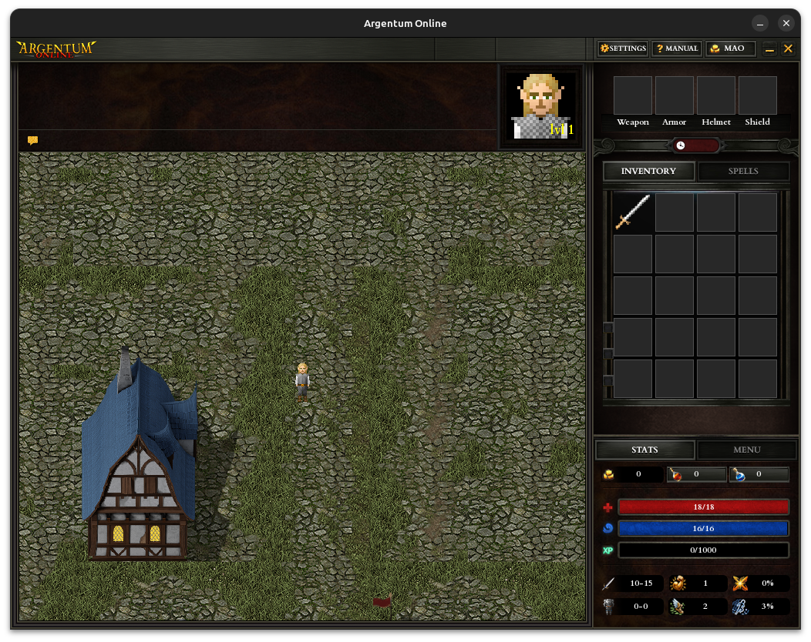

### 4.1 Barras de estado

Cada jugador tiene tres barras de estado principales:
- Barra de salud (roja): representa la cantidad de vida del personaje. Si llega a cero, el personaje muere y se convierte en un fantasma.
- Barra de maná (azul): representa la cantidad de maná disponible para lanzar hechizos. El maná se regenera con el tiempo, mediante el uso de pociones o el comando de meditación.
- Barra de experiencia (verde): representa el progreso del personaje hacia el siguiente nivel. Al ganar experiencia derrotando jugadores o monstruos, esta barra se llena. Cuando se llena por completo, el personaje sube de nivel, lo que aumenta sus stats.

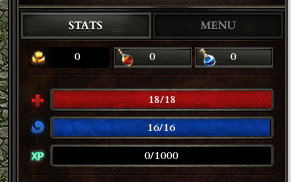

### 4.2 Stats del personaje

Cada personaje tiene los siguientes stats:
- **Daño:** representa la cantidad de daño que el personaje inflige con sus ataques. Se calcula en base a la fuerza del personaje y el arma equipada.
- **Fuerza:** aumenta el daño de los ataques cuerpo a cuerpo.
- **Probabilidad de crítico:** probabilidad de que un ataque inflija daño crítico (doble daño, no es esquivable). Se calcula en base a la agilidad y el arma equipada.
- **Defensa:** reduce el daño recibido. Se calcula en base a la constitución y la armadura equipada.
- **Agilidad:** aumenta la probabilidad de esquivar ataques y de acertar ataques a distancia con arco.
- **Probabilidad de evasión:** probabilidad de esquivar un ataque enemigo por completo. Se calcula en base a la agilidad y la armadura equipada.

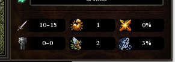

### 4.3 Inventario y equipamiento

El inventario del personaje se muestra en la parte derecha de la pantalla. Aquí puedes ver los objetos que has recogido, como armas, armaduras, pociones y otros ítems. 

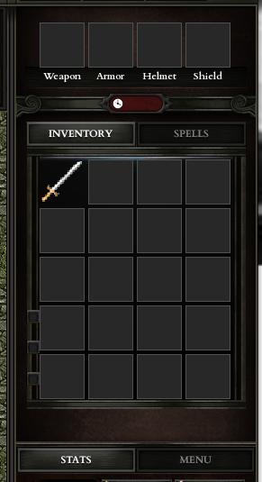

### 4.4 Oro

Debajo del inventario se encuentra la cantidad de oro que el personaje posee. El oro es la moneda del juego y se utiliza para comprar objetos a los mercaderes. El oro se puede obtener derrotando monstruos, vendiendo objetos a los mercaderes.

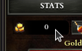

### 4.5 Chat

En la parte superior de la pantalla se encuentra la barra de chat, donde puedes comunicarte con otros jugadores. Puedes escribir comandos, mensajes para el chat general, mensajes privados a otros jugadores o mensajes para tu clan. Los mensajes muy largos se parten automáticamente en varias líneas según el ancho disponible de la ventana de chat (que difiere entre el modo compacto y el expandido, y según el tamaño de la ventana del juego). El historial guarda los últimos 100 mensajes.

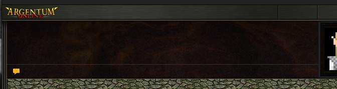

### 4.6 Nivel

A la derecha del chat, se muestra el nivel actual del personaje. El nivel se incrementa al ganar experiencia derrotando monstruos o jugadores, y al subir de nivel el personaje obtiene mejoras en sus stats.

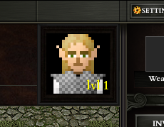

### 4.7 Vestimenta

El personaje se dibuja combinando varias capas de sprites:
- **Cuerpo:** por defecto depende de la **clase** del personaje (mago, clérigo, paladín o guerrero tienen cada uno su vestimenta común de base).
- **Cabeza:** depende de la **raza** (humano, elfo, enano o gnomo), y no cambia al equipar o desequipar objetos.
- **Armadura:** si hay una equipada, reemplaza el sprite del cuerpo (no el de la cabeza). Si no hay armadura equipada, se vuelve a mostrar la vestimenta común de la clase.
- **Arma o bastón, casco y escudo:** se dibujan como una capa superpuesta sobre el personaje, sin reemplazar nada.

El cambio es inmediato al equipar o desequipar un objeto (ver [7.6](#76-cómo-equipar-y-desequipar)), y es visible tanto para el propio jugador como para el resto de los jugadores en el mismo mapa. Las criaturas (mobs) no tienen este sistema de capas: cada una usa un único sprite fijo (ver [9.4](#94-criaturas)).

---

## 5. Controles

| Acción | Tecla / Input |
|--------|---------------|
| Moverse | Flechas direccionales / WASD |
| Moverse a una posición | Clic izquierdo en el mapa |
| Atacar (cuerpo a cuerpo / arco) | Clic izquierdo en el objetivo |
| Lanzar hechizo | Clic derecho en el objetivo |
| Interactuar con NPC | Clic izquierdo en el NPC |
| Abrir chat | Clic en la barra de chat |
| Escribir comando | Teclear `/` en el chat |

---

## 6. Combate

### 6.1 Cuerpo a cuerpo vs. distancia

- **Cuerpo a cuerpo:** se realiza con armas como espada, hacha o martillo. Requiere estar al lado del objetivo.
- **Distancia (arco):** se realiza con arco simple o compuesto. Permite atacar desde lejos. Las flechas son infinitas.
- **Distancia (hechizo):** se realiza con bastones mágicos. Consume maná y permite atacar a distancia con efectos especiales.


### 6.2 Hechizos

| Bastón | Hechizo | Efecto | Daño | Costo de maná |
|--------|---------|--------|------|----------------|
| Vara de fresno | Flecha mágica | Proyectil mágico | 2-4 | 5 |
| Báculo nudoso | Misil | Proyectil de mayor potencia | 4-8 | 15 |
| Báculo engarzado | Explosión | Explosión de gran daño | 8-20 | 30 |
| Flauta élfica | Curar | Restaura vida del jugador | — | 100 |

### 6.3 Golpes críticos y evasión

- **Golpe crítico:** inflige el doble de daño y no puede ser esquivado. La probabilidad se calcula en base a la agilidad del personaje y el arma equipada.
- **Evasión:** permite evitar por completo el daño de un ataque. La probabilidad depende de la agilidad del personaje y la armadura equipada.

### 6.4 Reglas de Fair Play

En el juego existen ciertas reglas de Fair Play que los jugadores deben seguir para garantizar una experiencia de juego justa y agradable para todos. Estas reglas incluyen:
- No se puede hacer PVP (Player vs Player) en zonas seguras.
- No se puede atacar a jugadores que están en un nivel de experiencia significativamente menor al tuyo. (Diferencia de niveles superior a 10; una diferencia de exactamente 10 está permitida)
- No se puede atacar a jugadores "newbies" (nivel 1-12) ni ellos pueden atacarte.

### 6.5 Penalización por muerte

Cuando un jugador muere, el jugador pasa a perder oro y experiencia, y todos los objetos de su inventario caen al piso. Además, el personaje se convierte en un fantasma, lo que le permite moverse pero no interactuar con otros jugadores o NPCs. 

Para resucitar, el jugador puede dirigirse al sanador de la ciudad más próxima o usar el comando /resucitar, lo que hará que el jugador aparezca resucitado junto al sanador después de un tiempo proporcional a la distancia entre él y el sanador.

---

## 7. Objetos y equipamiento

### 7.1 Armas

Existen las siguentes armas en el juego:
- Espada: arma de combate a mano, tiene un daño de 2 a 5. Precio: 50 de oro.

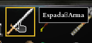

- Hacha: arma de combate a mano, tiene un daño de 4 a 5. Precio: 80 de oro.

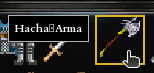

- Martillo: arma de combate a mano, tiene un daño de 1 a 9. Precio: 60 de oro.

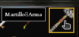

- Arco simple: arma a distancia, tiene un daño de 1 a 4. Las flechas son infinitas. Precio: 70 de oro.

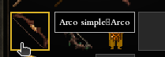

- Arco compuesto: arma a distancia, tiene un daño de 4 a 16. Las flechas son infinitas. Precio: 200 de oro.

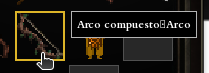

### 7.2 Armaduras, cascos y escudos
Existen las siguientes armaduras, cascos y escudos en el juego:
- Armadura de cuero: ofrece una defensa entre 2 y 6. Precio: 80 de oro.

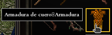

- Armadura de placas: ofrece una defensa entre 15 y 30. Precio: 400 de oro.

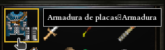

- Tunica azul: ofrece una defensa entre 6 y 10. Precio: 120 de oro.

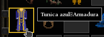

- Capucha: casco que ofrece defensa entre 1 y 4. Precio: 40 de oro.

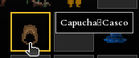

- Casco de hierro: ofrece defensa entre 4 y 8. Precio: 90 de oro.

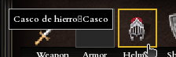

- Escudo de tortuga: ofrece defensa entre 1 y 2. Precio: 50 de oro.

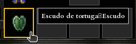

- Escudo de hierro: ofrece defensa entre 1 y 4. Precio: 100 de oro.

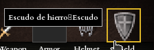

- Sombrero mágico: casco que ofrece una defensa entre 4 y 12. Precio: 110 de oro.

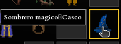

### 7.3 Bastones mágicos

Existen los siguientes bastones mágicos en el juego. Al igual que el arco, atacan a distancia (rango de 400 unidades):
- Vara de fresno: permite lanzar el hechizo "flecha mágica" que tiene un daño a distancia de 2 a 4. Consume 5 de mana. Precio: 100 de oro.

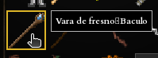

- Flauta élfica: permite lanzar el hechizo "curar" sobre el jugador que restaura la vida. Consume 100 de mana. Precio: 200 de oro.

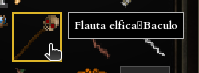

- Báculo nudoso: permite lanzar el hechizo "misil" que tiene un daño a distancia de 4 a 8. Consume 15 de mana. Precio: 150 de oro.

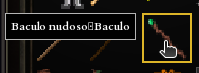

- Báculo engarzado: permite lanzar el hechizo "explosion" que tiene un daño a distancia de 8 a 20. Consume 30 de mana. Precio: 300 de oro.

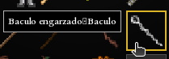

### 7.4 Pociones
Existen las siguientes pociones en el juego. Ambas restauran el 100% del recurso correspondiente (no son parciales) y se consumen apenas se equipan:
- Pocion de salud: Restaura toda la salud del personaje. Precio: 30 de oro.

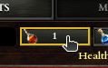

- Pocion de maná: Restaura todo el maná del personaje. Precio: 30 de oro.

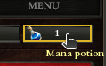

### 7.5 Compra y venta

Los precios indicados en las secciones anteriores son el precio de compra a un NPC (`/comprar <objeto>`), que solo puede vender lo que tiene listado en su inventario (ver sección [9.1](#91-tipos-de-npcs)). Al vender un objeto a un comerciante (`/vender <objeto>`), se recibe el 50% del precio de compra del objeto.

### 7.6 Cómo equipar y desequipar

Para equipar un objeto, simplemente haz click izquierdo sobre él en tu inventario.


Una vez equipado el objeto aparecerá en el slot correspondiente de tu personaje, y sus stats se aplicarán a tu personaje.

Para desequipar un objeto, haz click izquierdo sobre él en el slot del item equipado. El objeto volverá a tu inventario y sus stats dejarán de aplicarse a tu personaje.


---

## 8. Comandos

### 8.1 Comandos de juego

| Comando | Acción |
|---------|--------|
| `/meditar` | Entrar en meditación para recuperar maná |
| `/resucitar` | Resucitar en el sanador más cercano |
| `/curar` | Un sacerdote cercano te cura vida y maná |
| `/comprar <objeto>` | Comprar un objeto al NPC (mercader o sacerdote) |
| `/vender <objeto>` | Vender un objeto al comerciante |
| `/listar` | Ver el inventario de un NPC cercano |
| `/tomar` | Recoger del suelo cualquier ítem en la posición actual |
| `/tomar <objeto>` | Recoger del suelo un ítem específico por nombre (si hay varios apilados) |
| `/tirar <objeto>` | Tirar al suelo un ítem del inventario, identificado por nombre |
| `/equipar <slot>` | Equipar el ítem del slot indicado del inventario (número de slot) |
| `/desequipar <weapon\|armor\|helmet\|shield>` | Desequipar un ítem por tipo de ranura |
| `/depositar <objeto>` | Depositar un objeto en el banco |
| `/depositar oro <cant>` | Depositar oro en el banco |
| `/retirar <objeto>` | Retirar un objeto del banco |
| `/retirar oro <cant>` | Retirar oro del banco |

### 8.2 Comandos de chat

| Comando | Acción |
|---------|--------|
| `@<nick> <mensaje>` | Enviar un mensaje privado a un jugador |
| `/c <mensaje>` | Hablar por el chat del clan |
| `/clan <mensaje>` | ídem `/c` |
| `/help` | Mostrar la lista de comandos disponibles |

### 8.3 Comandos de clan

| Comando | Acción |
|---------|--------|
| `/fundar-clan <nombre>` | Fundar un clan (requiere nivel 6+) |
| `/unirse <nombre>` | Solicitar unirse a un clan |
| `/revisar-clan` | Revisar miembros y solicitudes pendientes (solo fundador) |
| `/clan-aceptar <nick>` | Aceptar una solicitud de ingreso (solo fundador) |
| `/clan-rechazar <nick>` | Rechazar una solicitud de ingreso (solo fundador) |
| `/clan-ban <nick>` | Banear a un jugador del clan (solo fundador) |
| `/clan-unban <nick>` | Desbanear a un jugador del clan (solo fundador) |
| `/clan-kick <nick>` | Expulsar a un miembro del clan (solo fundador) |
| `/dejar-clan` | Abandonar el clan actual |

---

## 9. NPCs y ciudades

### 9.1 Tipos de NPCs

| NPC | Función | Imagen |
|-----|---------|--------|
| **Sacerdote** | Cura al jugador (`/curar`), revive instantáneamente, vende bastones y pociones | 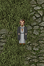 |
| **Sanadora** | Revive al jugador con una demora proporcional a la distancia (no vende ítems) | 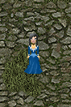 |
| **Mercader** | Compra y vende armas, armaduras, cascos, escudos y pociones (nunca hechizos) | 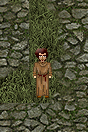 |
| **Banquero** | Depósito y retiro de ítems y oro (sucursal universal) | 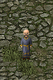 |


### 9.2 Zonas seguras vs. zona salvaje

En las ciudades y zonas seguras, los jugadores no pueden atacarse entre sí ni ser atacados por otros jugadores. Sin embargo, en la zona salvaje, los jugadores pueden atacarse libremente, lo que hace que el juego sea más peligroso pero también más emocionante.

### 9.3 Mazmorras

El juego cuenta con portales que pueden llevarte a diferentes mazmorras, donde puedes encontrar monstruos. Las mazmorras son zonas de alto riesgo: los monstruos que aparecen ahí son de nivel 6 a 15 (contra nivel 1 a 5 en zonas normales — ver [9.4](#94-criaturas) para cómo el nivel afecta sus stats) y, además, varios tipos de monstruo solo aparecen en mazmorras, con stats base mucho más altos que su contraparte de ciudad:

| Monstruo (ciudad) | HP / Daño base | Exclusivo de mazmorra | HP / Daño base |
|---|---|---|---|
| Weak goblin | 100 / 5 | Strong goblin | 250 / 12 |
| Basic skeleton | 175 / 10 | Warrior skeleton | 425 / 22 |
| Small spider | 80 / 4 | Big spider | 325 / 17 |
| Stone golem | 900 / 40 | Iron golem | 1350 / 55 |
| — | — | Orc | 600 / 28 |

Como en mazmorra el nivel sorteado es 6 a 15 en vez de 1 a 5, estos stats base se multiplican por un nivel mucho mayor (ver fórmula en [9.4](#94-criaturas)): por ejemplo, un Iron golem de nivel 15 llega a 20250 HP y 825 de daño.

Las mazmorras también ofrecen la oportunidad de obtener objetos raros y experiencia valiosa: la probabilidad de que un monstruo deje oro, poción u objeto al morir es notablemente mayor que en zonas normales.

| Drop | Zona normal | Mazmorra |
|------|-------------|----------|
| Oro | 8% | 20% |
| Poción | 1% | 3% |
| Objeto | 1% | 6% |


### 9.4 Criaturas

Las criaturas (mobs) atacan al jugador más cercano dentro de su rango de visión (250 px), incluso si el jugador no las ataca primero. Si el jugador se encuentra en una zona segura, la criatura no lo persigue ni lo ataca. Todas las criaturas atacan exclusivamente cuerpo a cuerpo.

Periódicamente aparecen nuevas criaturas en las zonas de spawn de cada mapa, hasta un límite poblacional configurado por mapa, garantizando que siempre haya criaturas en Argentum sin saturar el mundo:

| Mapa | Límite de población | Intervalo de spawn |
|---|---|---|
| Ciudad | 70 | cada 80 ticks |
| Mazmorra 1 | 15 | cada 80 ticks |
| Mazmorra 2 | 15 | cada 80 ticks |
| Mazmorra 3 | 50 | cada 80 ticks |

Al spawnear, cada criatura recibe un nivel al azar (1 a 5 en zonas normales, 6 a 15 en mazmorras) y sus stats finales se calculan multiplicando los valores base por ese nivel:

```
HP    = HP_base * Nivel
Daño  = Daño_base * Nivel
```

Por eso una misma criatura puede ser mucho más débil o más fuerte según en qué nivel le tocó aparecer. Stats base (equivalentes a nivel 1) de cada tipo de criatura:

| Criatura | HP base | Daño base | Velocidad | Exclusivo de mazmorra |
|---|---|---|---|---|
| Weak goblin | 100 | 5 | normal | No |
| Strong goblin | 250 | 12 | normal | Sí |
| Basic skeleton | 175 | 10 | normal | No |
| Warrior skeleton | 425 | 22 | normal | Sí |
| Zombie | 375 | 15 | lenta | No |
| Orc | 600 | 28 | lenta | Sí |
| Small spider | 80 | 4 | normal | No |
| Big spider | 325 | 17 | normal | Sí |
| Stone golem | 900 | 40 | lenta | No |
| Iron golem | 1350 | 55 | lenta | Sí |

> **Ejemplo:** un Weak goblin de nivel 5 (máximo en zona normal) tiene 500 HP y 25 de daño. Un Iron golem de nivel 15 (máximo en mazmorra) tiene 20250 HP y 825 de daño.

Al morir, una criatura tiene una probabilidad de dejar caer algo al suelo (ver la sección [9.3](#93-mazmorras) para las probabilidades específicas en mazmorras). El oro obtenido es proporcional al HP máximo de la criatura (`rand(0.01, 0.2) * HP_max`), por lo que las criaturas de mayor nivel también dejan más oro:

| Resultado | Probabilidad (zona normal) |
|---|---|
| Nada | 90% |
| Oro | 8% |
| Poción de vida o de maná (al azar) | 1% |
| Objeto al azar | 1% |

---

## 10. Clanes

### 10.1 Requisitos para fundar un clan

Para fundar un clan, un jugador debe cumplir con los siguientes requisitos:
- Tener un nivel de 6 o más.
- Elegir un nombre único para el clan que no esté siendo utilizado por otro clan existente.
- No pertenecer ya a un clan (cada jugador solo puede estar en uno a la vez).

Un clan admite un máximo de **16 miembros**, incluido el fundador. Una vez alcanzado ese límite, no se pueden aceptar más solicitudes de ingreso hasta que algún miembro lo abandone, sea expulsado o baneado.

### 10.2 Administración de miembros

| Comando | Acción |
|---------|--------|
| `/unirse <nombre>` | Solicitar unirse a un clan |
| `/revisar-clan` | Ver miembros (con su estado online/offline) y solicitudes pendientes (solo fundador) |
| `/clan-aceptar <nick>` | Aceptar una solicitud (solo fundador) |
| `/clan-rechazar <nick>` | Rechazar una solicitud (solo fundador) |
| `/clan-ban <nick>` | Banear a un jugador: lo expulsa (si era miembro) y le impide volver a pedir ingreso (solo fundador) |
| `/clan-unban <nick>` | Quitar el baneo de un jugador, permitiéndole volver a pedir ingreso (solo fundador) |
| `/clan-kick <nick>` | Expulsar a un miembro sin banearlo (solo fundador) |
| `/dejar-clan` | Abandonar el clan |

El fundador no puede banearse, expulsarse ni abandonar el clan a sí mismo: mientras siga en el clan, siempre es su fundador. Disolver un clan no está soportado.

### 10.3 Bonus de combate en grupo

Los jugadores que pertenecen al mismo clan reciben una bonificación de daño de ataque y de defensa proporcional a la cantidad de miembros de su clan que estén cerca (a menos de 200 px). Cada aliado cercano otorga **+5%** de bonificación, hasta un máximo de **+25%** (a partir de 5 aliados cercanos no se obtiene bonificación adicional). Esto significa que cuantos más miembros del clan estén cerca, mayor será la bonificación para cada uno de ellos, lo que fomenta el juego en grupo y la cooperación entre los miembros del clan.

Además, los miembros de un mismo clan **no pueden atacarse entre sí**.

### 10.4 Notificaciones de clan

Los miembros de un clan reciben notificaciones automáticas (visibles en el chat) ante los siguientes eventos:
- Un compañero de clan se conecta o se desconecta.
- Un compañero de clan está siendo atacado.
- Alguien solicita unirse al clan (solo el fundador).
- El propio jugador es aceptado o rechazado al pedir unirse a un clan.

### 10.5 Chat de clan

Los miembros de un clan pueden comunicarse entre sí utilizando el chat de clan, que se activa con el comando /c <mensaje>. Este chat es exclusivo para los miembros del clan, lo que permite una comunicación más directa y privada entre ellos.

---

## 11. Muerte y resurrección

### 11.1 Convertirse en fantasma

Cuando un jugador muere, su personaje se convierte en un fantasma. En este estado, el jugador puede moverse libremente por el mapa, pero no puede interactuar con otros jugadores, NPCs o objetos. El fantasma es completamente intangible y no puede ser atacado ni atacar a otros jugadores. El objetivo del jugador en este estado es llegar al sanador de la ciudad más cercana para resucitar su personaje. 

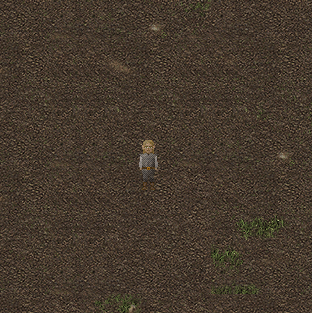

### 11.2 Pérdida de ítems, oro y experiencia

Al morir, el jugador pierde una cantidad de oro y experiencia proporcional a su nivel actual. Además, todos los objetos que el jugador tenía en su inventario caen al suelo en la ubicación donde murió. Otros jugadores pueden recoger estos objetos, lo que hace que la muerte sea una experiencia arriesgada, especialmente en zonas salvajes donde otros jugadores pueden estar cerca.

### 11.3 Cómo resucitar

Para resucitar, el jugador puede dirigirse al sanador de la ciudad más cercana. El sanador es un NPC que se encuentra en cada ciudad y que ofrece servicios de curación y resurrección. Al acercarse al sanador, el jugador puede interactuar con él y seleccionar la opción de resucitar. 

Tambien el jugador puede optar por el comando /resucitar, lo que hará que el jugador aparezca resucitado junto al sanador de la ciudad más próxima después de un tiempo proporcional a la distancia entre él y el sanador. Esta opción es útil si el jugador no quiere caminar hasta el sanador o si está en una zona peligrosa donde otros jugadores podrían atacarlo mientras intenta llegar al sanador.

---

## 12. Meditación

### 12.1 Cómo meditar

Para meditar, el jugador debe usar el comando /meditar. Al ingresar este comando, el personaje entrará en un estado de meditación durante el cual no podrá realizar ninguna otra acción. Durante la meditación, el personaje recuperará maná a una tasa constante hasta alcanzar su máximo de maná. Cualquier acción que el jugador intente realizar mientras está meditando, como moverse, atacar o interactuar con NPCs, lo sacará inmediatamente del estado de meditación, deteniendo la recuperación de maná.

### 12.2 Regeneración de maná

El maná se regenera automáticamente con el tiempo, incluso sin meditar. Sin embargo, la tasa de regeneración de maná es mucho más lenta que la recuperación que se obtiene al meditar. Por lo tanto, aunque el maná se recupera gradualmente con el tiempo, es recomendable usar la meditación para recuperar maná de manera más eficiente, especialmente durante combates o situaciones donde se necesite una gran cantidad de maná en poco tiempo.

### 12.3 Limitaciones

El guerrero es la única clase que no puede usar magia ni meditar, y su maná siempre es 0. Esto significa que el guerrero no puede recuperar maná a través de la meditación ni beneficiarse de la regeneración de maná con el tiempo, lo que lo hace dependiente de sus habilidades físicas y armas para el combate.


---

## 13. Editor de mapas

### 13.1 ¿Qué es `taller_editor`?

El juego incluye una herramienta de edición de mapas llamada `taller_editor`, que permite a los jugadores crear y modificar mapas personalizados para el juego. Con esta herramienta, los jugadores pueden diseñar sus propios niveles, colocar zonas de spawn de enemigos y NPCs, y luego guardar sus mapas para compartirlos con otros jugadores o usarlos en su propia experiencia de juego.


### 13.2 Interfaz del editor

El editor tiene una interfaz gráfica que muestra el mapa en construcción, con diferentes herramientas y opciones para editar el mapa. En la parte superior izquierda se encuentran las tipicas opciones de archivo (nuevo, abrir, guardar), y la seleccion de tamaño del mapa. 

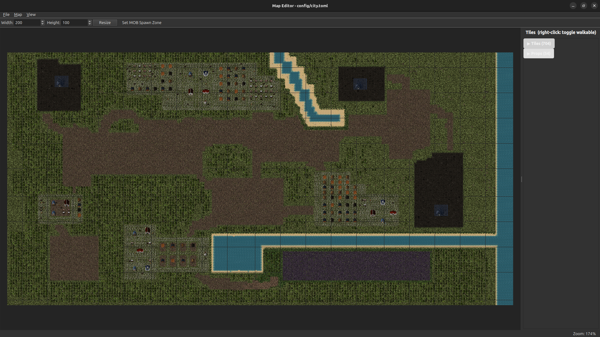

Tambien, se encuentran disponibles las herramientas de edicion de spawn de enemigos y de zonas no caminables.

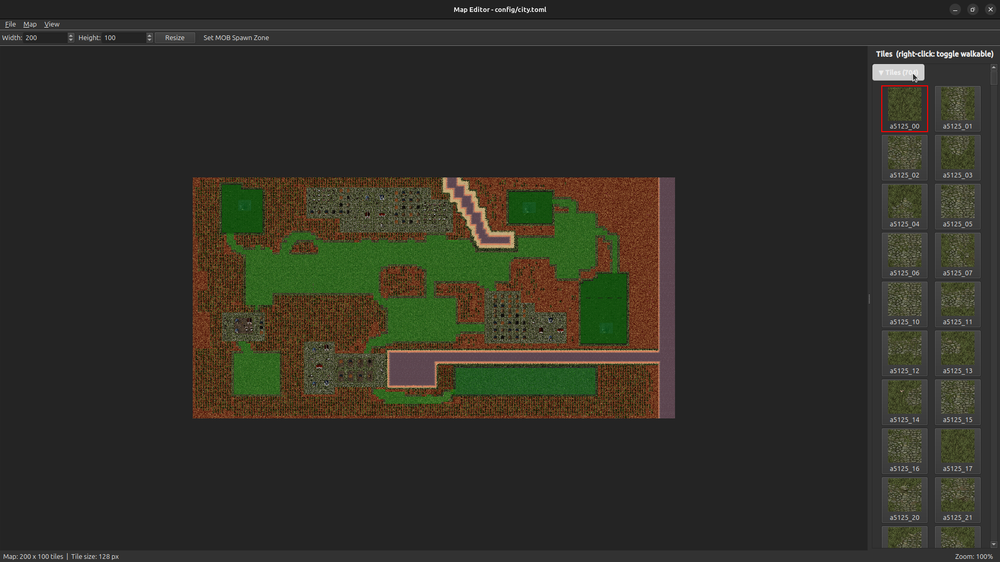

### 13.3 Pintar tiles y colocar props

El editor cuenta con el apartado de tiles, donde se pueden seleccionar los diferentes tipos de terreno y objetos que se pueden colocar en el mapa. 

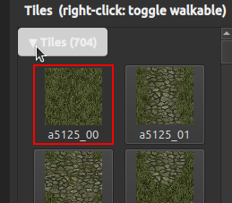

También tiene un apartado de props, donde se pueden colocar elementos decorativos como árboles, rocas, NPCs, etc.

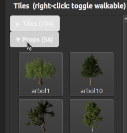

Existen tambien los portales, que permiten colocar zonas de transición a otras mazmorras.

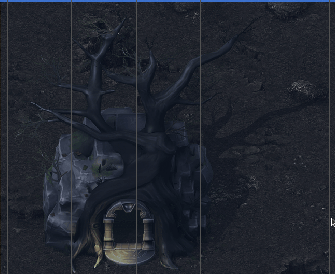

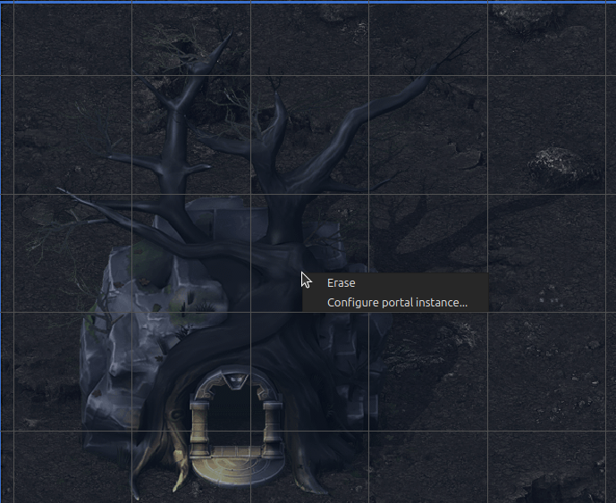

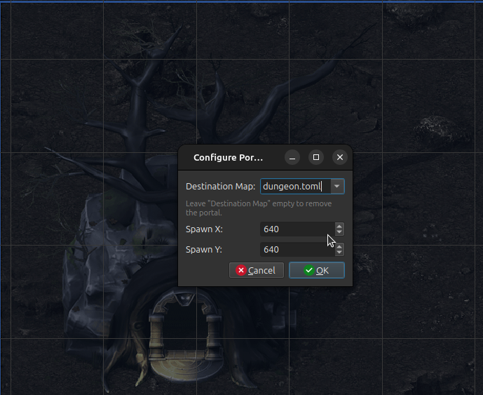


### 13.4 Guardar y cargar mapas

Para guardar un mapa, simplemente haz clic en el botón "Guardar" en la parte superior izquierda de la interfaz del editor. Esto abrirá un cuadro de diálogo donde podrás elegir la ubicación y el nombre del archivo para guardar tu mapa. 

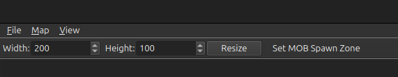

---

## 14. Trucos / Cheats (debug)

### 14.1 Habilitar cheats

Los cheats deben estar habilitados en el servidor. Se configuran en `config/server.toml`:

```toml
cheats_enabled = true
```

Se activan desde el cliente con combinaciones de **Ctrl + tecla**.

### 14.2 Lista de comandos de debug

| Combinación | Efecto |
|-------------|--------|
| Ctrl + H | Vida infinita (alternar) |
| Ctrl + M | Maná infinito (alternar) |
| Ctrl + K | Muerte instantánea |
| Ctrl + V | Subir un nivel |
| Ctrl + B | Bajar un nivel |
| Ctrl + G | Agregar 1000 de oro |
| Ctrl + 0 | Resetear oro a 0 |
| Ctrl + F | Velocidad aumentada (alternar) |
| Ctrl + R | Revivir |
| Ctrl + I | Llenar inventario con todos los ítems |
| Ctrl + L | Limpiar inventario |
| Ctrl + 9 | Resetear maná a 0 |

---

## 15. Configuración

> **Nota:** no existe un parámetro para limitar la cantidad máxima de jugadores conectados simultáneamente; el servidor acepta conexiones sin ese límite.

### 15.1 `server.toml`

Ubicado en `config/server.toml`. Controla parámetros del servidor:

| Sección | Parámetro | Descripción |
|---|---|---|
| `[server]` | `port` | Puerto de escucha (defecto: 1234) |
| `[server]` | `tick_rate_hz` | Ticks por segundo del game loop (defecto: 20) |
| `[server]` | `save_interval_seconds` | Intervalo (en segundos) de persistencia automática de jugadores (defecto: 30) |
| `[server]` | `cheats_enabled` | Habilita o deshabilita los comandos de debug |
| `[movement]` | `move_step` | Velocidad de movimiento, en píxeles por tick |
| `[sprite]` | `width`, `height` | Dimensiones en píxeles del sprite del personaje, usadas para colisiones |
| `[attack]` | `base_damage` | Daño base de ataque |
| `[attack]` | `attack_range_px` | Rango de ataque cuerpo a cuerpo (píxeles) |
| `[attack]` | `spell_attack_range_px` | Rango de ataque a distancia (arco/hechizo), en píxeles |
| `[attack]` | `damage_variance` | Variación aleatoria aplicada al daño base |
| `[attack]` | `cooldown_ticks` | Ticks de espera entre ataques |
| `[attack]` | `xp_per_level_kill` | Experiencia base otorgada por nivel de diferencia al matar |
| `[attack]` | `newbie_level` | Nivel máximo considerado "newbie" (no puede atacar ni ser atacado) |
| `[attack]` | `max_level_diff` | Diferencia máxima de nivel permitida en PvP |
| `[attack]` | `clan_bonus_range_px` | Radio para que un aliado de clan otorgue bonificación |
| `[attack]` | `clan_bonus_per_member` | Bonificación de daño/defensa por cada aliado cercano |
| `[attack]` | `clan_bonus_max` | Tope de la bonificación de clan |
| `[attack]` | `critical_chance` | Probabilidad base de golpe crítico |
| `[attack]` | `npc_vision_range_px` | Rango de visión de las criaturas (píxeles) |
| `[attack]` | `npc_speed` | Velocidad de movimiento de las criaturas |
| `[clan]` | `max_members` | Máximo de miembros por clan (incluido el fundador) |
| `[clan]` | `min_level_found` | Nivel mínimo para fundar un clan |
| `[clan]` | `max_name_length` | Longitud máxima del nombre de un clan |
| `[mob_spawn]` | `spawn_radius` | Radio alrededor del punto de spawn donde puede aparecer una criatura |
| `[mob_spawn]` | `min_level`, `max_level` | Rango de nivel sorteado para criaturas en zona normal |
| `[mob_spawn.dungeon]` | `min_level`, `max_level` | Rango de nivel sorteado para criaturas en mazmorra |
| `[inventory]` | `max_slots` | Cantidad máxima de objetos en el inventario |
| `[inventory]` | `max_hp_potions`, `max_mana_potions` | Tope de pociones de cada tipo en inventario |
| `[inventory]` | `max_bank_slots` | Cantidad máxima de objetos en el banco |
| `[balance]` | `starting_gold` | Oro inicial al crear personaje |
| `[balance]` | `starting_pos_x`, `starting_pos_y`, `starting_map` | Posición y mapa donde aparece un personaje nuevo |
| `[balance]` | `min_level`, `max_level` | Rango de nivel válido para un jugador |
| `[balance]` | `gold_per_level` | Oro perdido al morir, por nivel |
| `[balance]` | `level_exp_base`, `level_exp_exponent` | Parámetros de la fórmula de experiencia requerida por nivel |
| `[balance]` | `gold_cap_base`, `gold_cap_exponent` | Parámetros de la fórmula de oro máximo "seguro" (ver [Consigna](consigna_Argentum)) |
| `[balance.npc_drop]` | `gold_chance`, `potion_chance`, `item_chance` | Probabilidades de drop al matar criaturas en zona normal |
| `[balance.npc_drop_dungeon]` | `gold_chance`, `potion_chance`, `item_chance` | Probabilidades de drop al matar criaturas en mazmorra |
| `[recovery_rates]` | `human`, `elf`, `dwarf`, `gnome` | Tasa de recuperación de vida/maná por raza con el paso del tiempo |
| `[constitution]` | `human`, `elf`, `dwarf`, `gnome` | Constitución base por raza (usada en la fórmula de vida máxima) |
| `[intelligence]` | `human`, `elf`, `dwarf`, `gnome` | Inteligencia base por raza (usada en la fórmula de maná máximo) |
| `[race_hp_factor]` / `[class_hp_factor]` | `human/elf/dwarf/gnome` · `warrior/paladin/cleric/mage` | Factores de raza y clase para vida máxima |
| `[race_mana_factor]` / `[class_mana_factor]` | ídem | Factores de raza y clase para maná máximo |
| `[class_meditation_factor]` | `warrior/paladin/cleric/mage` | Factor de clase para recuperación de maná meditando |
| `[race_strength_factor]` / `[class_strength_factor]` | ídem | Factores de raza y clase para fuerza |
| `[race_agility_factor]` / `[class_agility_factor]` | ídem | Factores de raza y clase para agilidad |
| `[starting_items]` | `warrior`, `mage`, `paladin`, `cleric` | Ítems iniciales por clase |
| `[merchant]` | `interaction_range_tiles` | Distancia máxima (en tiles) para interactuar con un NPC |
| `[merchant]` | `sell_price_ratio` | Porcentaje del precio de compra que se recibe al vender |
| `[vendors]` | — | Inventario de cada NPC vendedor (uno por nombre de NPC) |
| `[help]` | `lines` | Texto de ayuda del comando `/help` |

### 15.2 `client.toml`

Ubicado en `config/client.toml`. Controla parámetros del cliente:

| Sección | Descripción |
|---|---|
| `[network]` | Host y puerto del servidor (defecto: 127.0.0.1:1234) |
| `[window]` | Dimensiones y título de la ventana |
| `[background]` | Imagen y posición del fondo de la pantalla de login |
| `[viewport]` | Área lógica donde se dibuja el mundo dentro de la ventana del juego |
| `[font]` | Ruta de la fuente y tamaños de texto usados en la interfaz |
| `[ui]` (y subtablas `[ui.*]`) | Posiciones y dimensiones de cada elemento de la interfaz (inventario, barras de vida/maná/experiencia, oro, stats, comerciante, retrato, etc.) |
| `[assets]` | Rutas de las imágenes de la interfaz (botones, fondos, barras) |
| `[[sprites]]` | Sprites estáticos de ejemplo/depuración |
| `[skins]` | Sprites de cuerpo por clase, de cabeza por raza, y de cada NPC |
| `[movement]` | Parámetros de animación de movimiento (tamaño y cantidad de frames, velocidad) |
| `[[item_sprites]]` | Sprite e ícono de cada tipo de ítem, para inventario y suelo |
| `[[equip_overlays]]` | Sprite superpuesto al personaje al equipar cada tipo de ítem |
| `[ground_items]` | Tamaño y animación de flotación de los ítems en el suelo |
| `[audio]` | Música de fondo y configuración del mixer (frecuencia, canales) |
| `[sfx]` | Archivo de sonido para cada efecto (golpe, muerte, meditar, subir de nivel, etc.) |
| `[damage_overlay]` | Animación del número/efecto de daño sobre las entidades |
| `[[spell_sheets]]` | Spritesheets de animación de cada hechizo |
| `[interactable_props]` | Diálogo, sonido y comportamiento (vendedor/no) de cada tipo de NPC |

---

## 16. Solución de problemas (FAQ)

### 16.1 No puedo conectarme al servidor

En caso de que el cliente no pueda conectarse al servidor, asegúrate de que el servidor esté corriendo y escuchando en el puerto correcto (1234 por defecto). 

Verifica también que no haya un firewall bloqueando la conexión entre el cliente y el servidor. Si estás intentando conectarte desde otra máquina, asegúrate de usar la dirección IP correcta del servidor.

### 16.2 El juego se ve mal / faltan sprites

Si el juego se ve mal o faltan sprites, es posible que haya un problema con la instalación o con los archivos del juego. Intenta reinstalar el juego utilizando el instalador `install.sh` para asegurarte de que todos los archivos necesarios estén presentes y correctamente configurados.

### 16.3 ¿Cómo hago backup de mi personaje?

Los datos de los jugadores se guardan en los archivos `data/players.dat` y `data/players.idx`. Para hacer una copia de seguridad, copiá estos archivos a un lugar seguro. Para restaurar, detené el servidor y reemplazá los archivos.

### 16.4 Errores de compilación

Si encuentras errores de compilación al intentar construir el juego, asegúrate de tener todas las dependencias necesarias instaladas. Revisa la sección de instalación y asegúrate de que el instalador `install.sh` se haya ejecutado correctamente. Si el problema persiste, revisa los mensajes de error específicos para identificar qué dependencia o archivo está causando el problema y busca una solución en línea o en la documentación de esa dependencia.

---

## Créditos

Assets del juego

Repositorio: https://github.com/ao-org/Recursos

Las clases Socket, Resolver, LibError y ResolverError son las provistas por la cátedra

Repositorio: https://github.com/eldipa/sockets-en-cpp


Las clases Thread y Queue son las provistas por la cátedra

Repositorio: https://github.com/eldipa/hands-on-threads
